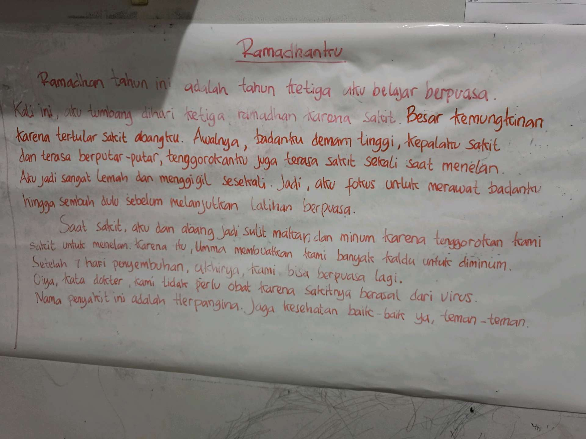
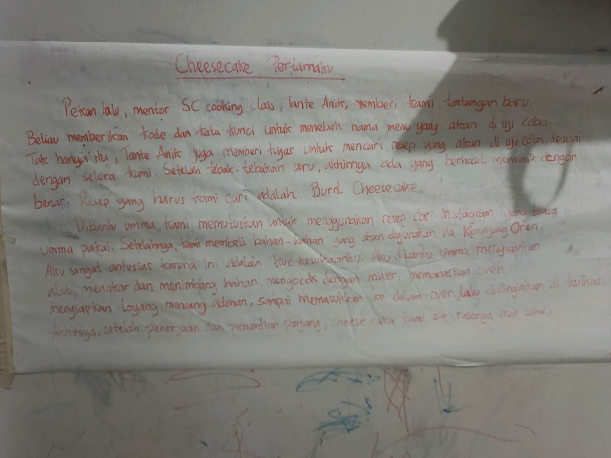

# 3 Maret 2026 - Log Kegiatan Harian
[Kembali](readme.md)

## 📌 Kegiatan
1. Kegiatan Utama:
   - Kegiatan: Pemulihan dari Herpangina (penyakit virus dengan gejala demam tinggi, sakit tenggorokan, sakit kepala). Abang fokus rawat badan setelah tertular dari adik-kakak, minum kaldu hangat dan istirahat cukup. Setelah ~7 hari pemulihan, mulai bisa lanjut latihan berpuasa Ramadhan kembali.
   - Alat/bahan: kaldu hangat (dibuatkan umma), istirahat
   - Durasi: -

## 🎯 Capaian Kegiatan
- Disiplin rawat badan saat sakit (istirahat, asupan cairan hangat).
- Lanjut latihan berpuasa Ramadhan setelah kondisi membaik.

## 🚧 Kendala
- Tertular sakit Herpangina dari saudara — gejala virus (demam, sakit tenggorokan, sakit kepala) membuat aktivitas terhenti sementara.

## 🖼️ Dokumentasi Kegiatan

[Kembali](readme.md)
