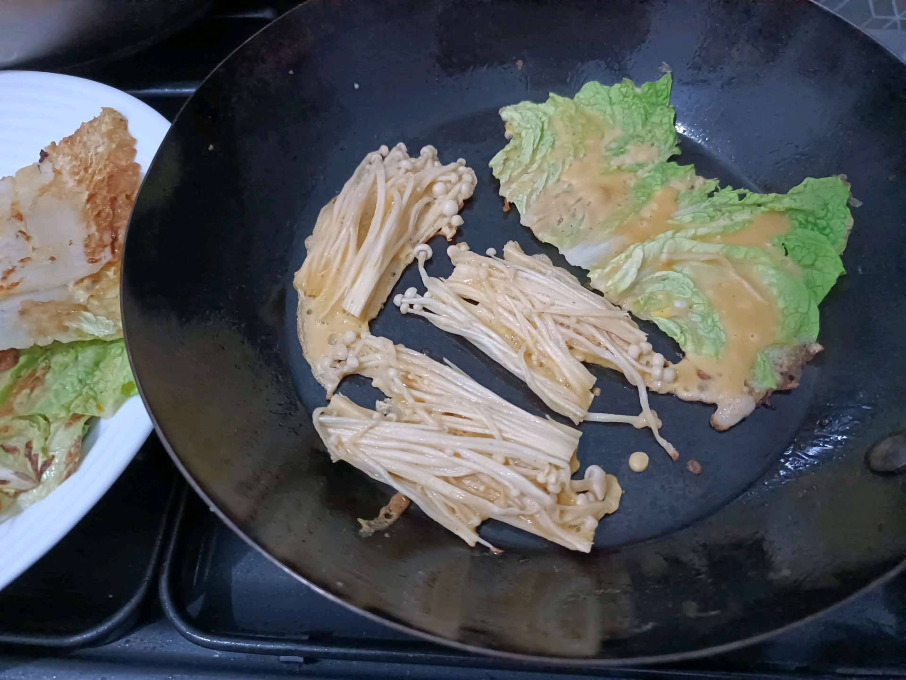

# 5 Maret 2026 - Log Kegiatan Harian
[Kembali](readme.md)

## 📌 Kegiatan
1. Kegiatan Utama:
   - Kegiatan: Eksperimen dapur — Abang ikut memasak jamur enoki dan sawi/kembang kol dengan adonan telur tipis di wajan, gaya hidangan Asia (jeon/yachaejeon Korea atau telur dadar sayur Jepang). Latihan menumis dan memasak telur dengan kontrol api kompor.
   - Alat/bahan: wajan, enoki, sawi, telur
   - Durasi: -

## 🎯 Capaian Kegiatan
- Latihan teknik memasak telur dengan sayuran sebagai isi.
- Eksplorasi tekstur baru (enoki kenyal vs sawi renyah) dalam satu hidangan.

## 🚧 Kendala
- -

## 🖼️ Dokumentasi Kegiatan

[Kembali](readme.md)
