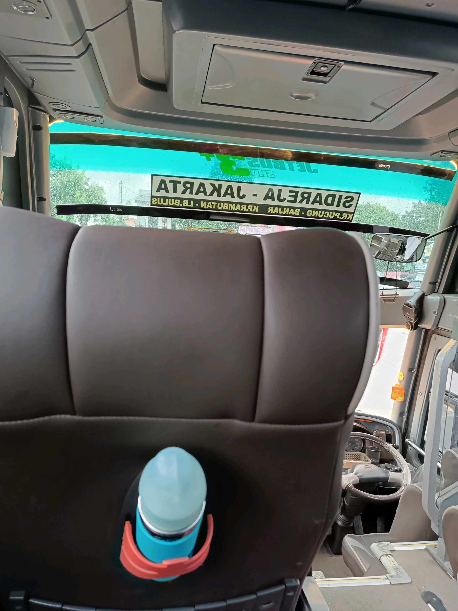
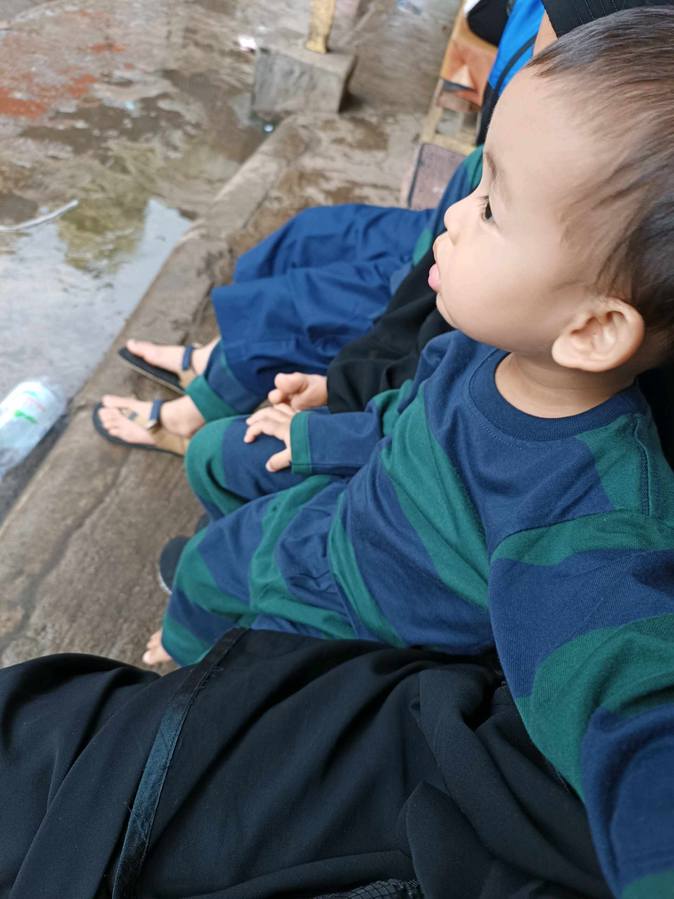

# 6 Maret 2026 - Log Kegiatan Harian
[Kembali](readme.md)

## 📌 Kegiatan
1. Kegiatan Utama:
   - Kegiatan: Perjalanan keluarga — Abang ikut bersama keluarga naik bus AKAP rute Sidareja – Jakarta (via Kr. Pucung, Banjar, Krembutan, Lebak Bulus). Latihan stamina perjalanan jauh dan adaptasi di moda transportasi umum.
   - Alat/bahan: bekal perjalanan, botol minum
   - Durasi: ~ perjalanan panjang (overnight)
2. Kegiatan Tambahan:
   - Kegiatan: Menemani adik selama perjalanan / istirahat di terminal.
   - Alat/bahan: -
   - Durasi: -

## 🎯 Capaian Kegiatan
- Latihan adaptasi perjalanan jauh dengan transportasi umum.
- Tanggung jawab sebagai kakak: ikut menjaga adik selama perjalanan.

## 🚧 Kendala
- Perjalanan panjang menuntut stamina dan kesabaran.

## 🖼️ Dokumentasi Kegiatan

[Kembali](readme.md)
