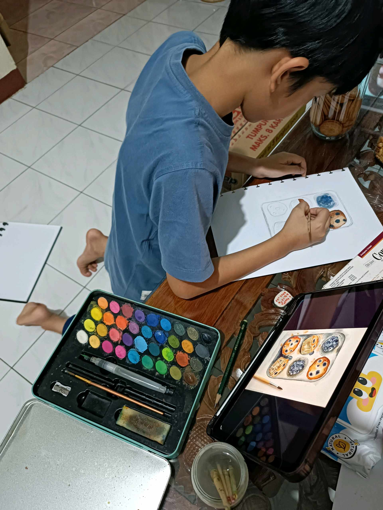

# 7 Maret 2026 - Log Kegiatan Harian
[Kembali](readme.md)

## 📌 Kegiatan
1. Kegiatan Utama:
   - Kegiatan: SC Seni Lukis — Abang melukis cat air bertema baking tray berisi muffin/cookies (blueberry muffin, choco chip cookies dengan paper liner merah-putih). Menggunakan referensi visual dari iPad, dengan latar splatter biru sebagai detail artistik.
   - Alat/bahan: cat air, kuas, kertas lukis, palet warna, iPad untuk referensi
   - Durasi: -

## 🎯 Capaian Kegiatan
- Karya cat air bertema baking tray muffin selesai dengan detail tekstur dan warna realistis.
- Berlatih teknik splatter background sebagai elemen artistik.
- Belajar menggunakan referensi visual digital sebagai bantuan menggambar.

## 🚧 Kendala
- -

## 🖼️ Dokumentasi Kegiatan

[Kembali](readme.md)
