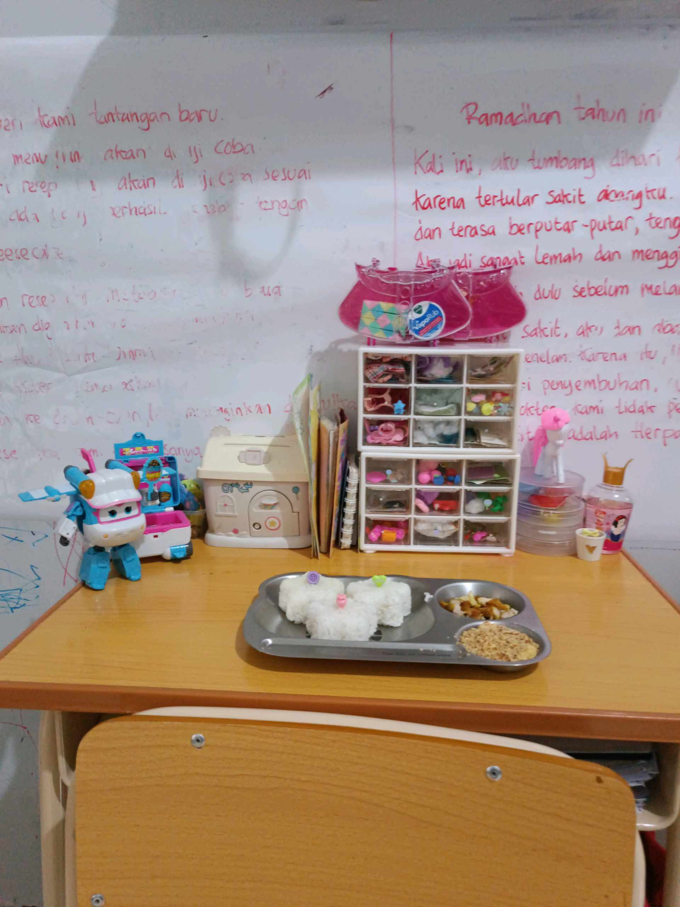

# 6 April 2026 - Log Kegiatan Harian
[Kembali](readme.md)

## 📌 Kegiatan
1. Kegiatan Utama:
   - Kegiatan: Aktivitas dapur bersama keluarga — bread pudding (roti panggang lembap) dengan topping kismis dan almond serta saus susu, dan menyiapkan bento nasi lucu berbentuk onigiri bear dengan lauk ayam dan abon. Abang ikut proses menyiapkan dan menikmati hasil masakan keluarga.
   - Alat/bahan: roti, telur, susu, kismis, almond, nasi, cetakan onigiri, ayam, abon
   - Durasi: -

## 🎯 Capaian Kegiatan
- Mengenal teknik bread pudding (rendam roti dalam custard, panggang).
- Apresiasi presentasi makanan: bento dengan bentuk lucu sebagai latihan estetika kuliner.

## 🚧 Kendala
- -

## 🖼️ Dokumentasi Kegiatan

[Kembali](readme.md)
