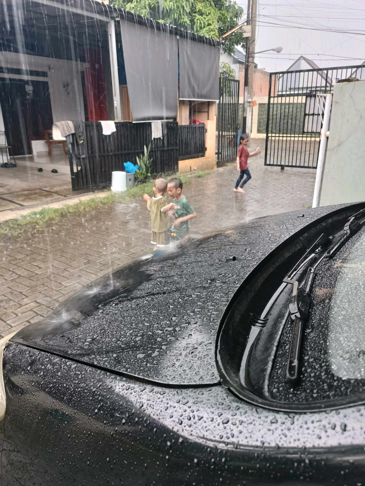

# 7 April 2026 - Log Kegiatan Harian
[Kembali](readme.md)

## 📌 Kegiatan
1. Kegiatan Utama:
   - Kegiatan: Bermain hujan di depan rumah bersama adik dan teman saat hujan deras turun. Aktivitas outdoor spontan, menikmati udara basah dan kebersamaan.
2. Kegiatan Tambahan:
   - Kegiatan: Setelah lantai rumah basah dari hujan, Abang ikut kerja bakti membersihkan lantai dengan sapu karet/squeegee gagang panjang. Tanggung jawab atas konsekuensi aktivitas main hujan.
   - Alat/bahan: squeegee, handuk pel
   - Durasi: -

## 🎯 Capaian Kegiatan
- Aktivitas outdoor & motorik kasar.
- Tanggung jawab kebersihan setelah bermain.

## 🚧 Kendala
- -

## 🖼️ Dokumentasi Kegiatan

[Kembali](readme.md)
