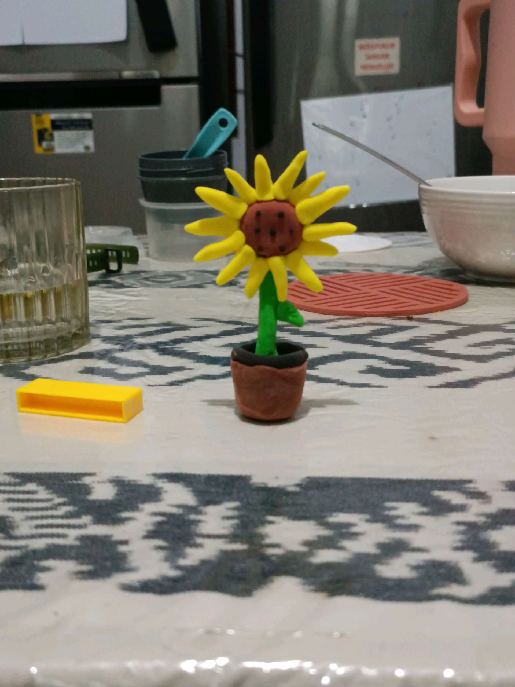

# 8 April 2026 - Log Kegiatan Harian
[Kembali](readme.md)

## 📌 Kegiatan
1. Kegiatan Utama:
   - Kegiatan: Family time di ruang belajar — sesi craft membuat karya 3D dari clay/lilin plastisin (bunga matahari dalam pot kecil). Suasana belajar tenang di rumah.
   - Alat/bahan: clay/lilin plastisin warna-warni
   - Durasi: -

## 🎯 Capaian Kegiatan
- Latihan motorik halus dengan membentuk clay 3D.
- Ekspresi seni patung mini.

## 🚧 Kendala
- -

## 🖼️ Dokumentasi Kegiatan

[Kembali](readme.md)
