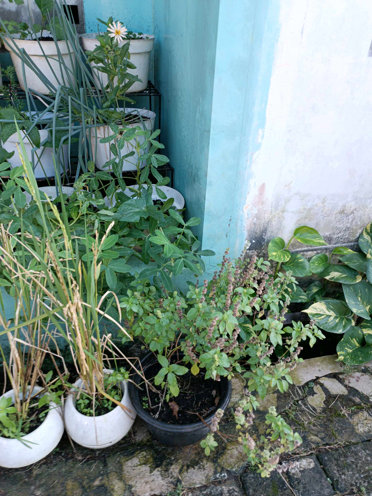
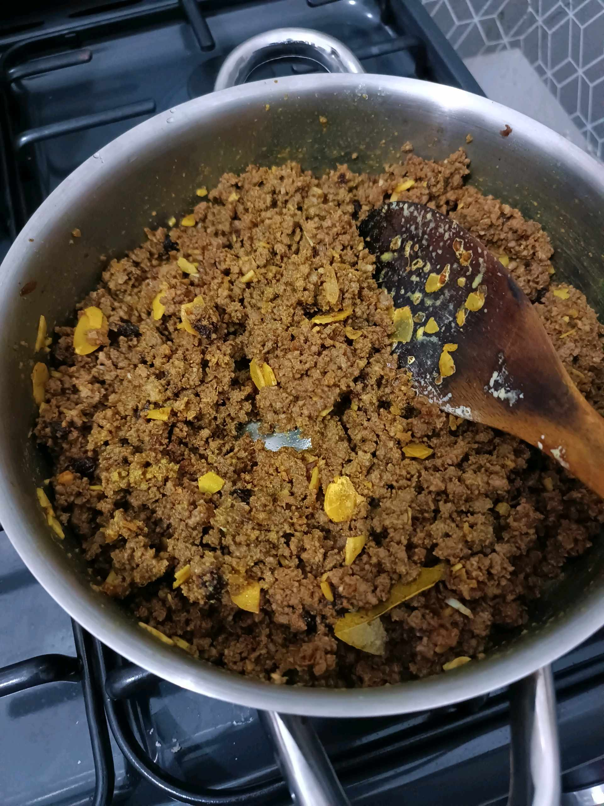
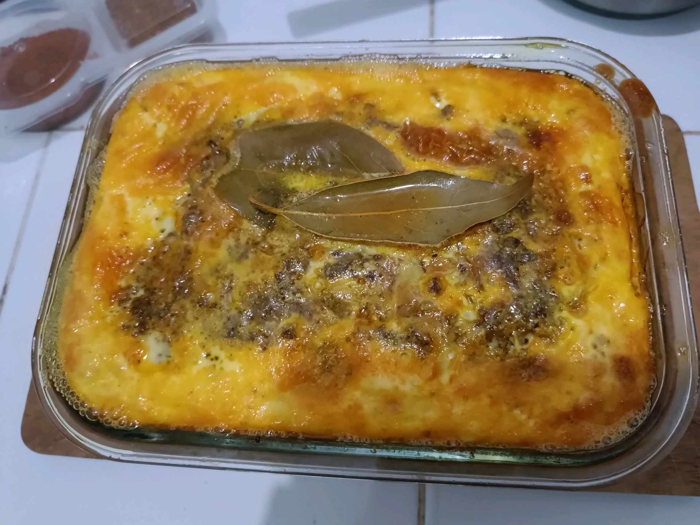

# 13 April 2026 - Log Kegiatan Harian
[Kembali](readme.md)

## 📌 Kegiatan
1. Kegiatan Utama:
   - Kegiatan: Cek urban farming — basil, tomat, mint, parsley, kacang tanah, dan tanaman aromatik lain di area kebun samping rumah tumbuh subur.
2. Kegiatan Tambahan:
   - Kegiatan: SC Cooking — membuat hidangan oven berbasis daging cincang berbumbu (kunyit, ketumbar) dengan topping custard telur-susu dan daun salam di atasnya, gaya **Bobotie** Afrika Selatan. Abang ikut tumis daging, menuang adonan ke loyang kaca, dan memantau saat dipanggang.
   - Alat/bahan: daging cincang, telur, susu, bumbu, daun salam, loyang kaca, oven, wajan
   - Durasi: -

## 🎯 Capaian Kegiatan
- Konsistensi merawat kebun rumah.
- Membuat hidangan oven baru bertema kuliner Afrika (Bobotie).
- Memahami konsep "casserole" — daging + custard yang dipanggang bersama.

## 🚧 Kendala
- -

## 🖼️ Dokumentasi Kegiatan

[Kembali](readme.md)
