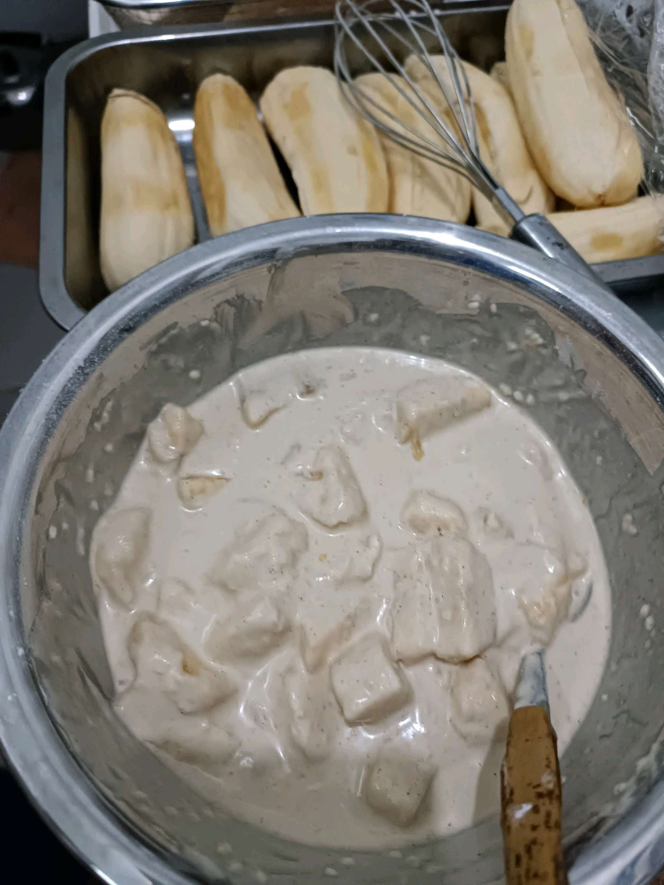

# 14 April 2026 - Log Kegiatan Harian
[Kembali](readme.md)

## 📌 Kegiatan
1. Kegiatan Utama:
   - Kegiatan: Membuat **pisang goreng wijen** — Abang ikut mengupas pisang, mencelupkan potongan pisang ke adonan tepung, lalu menggoreng hingga renyah dengan taburan wijen. Camilan khas Nusantara.
   - Alat/bahan: pisang, tepung, gula, telur, wijen, minyak, wajan, whisk
   - Durasi: -

## 🎯 Capaian Kegiatan
- Belajar membuat camilan tradisional (pisang goreng) dari nol.
- Latihan menggoreng dengan kontrol suhu minyak.

## 🚧 Kendala
- -

## 🖼️ Dokumentasi Kegiatan

[Kembali](readme.md)
