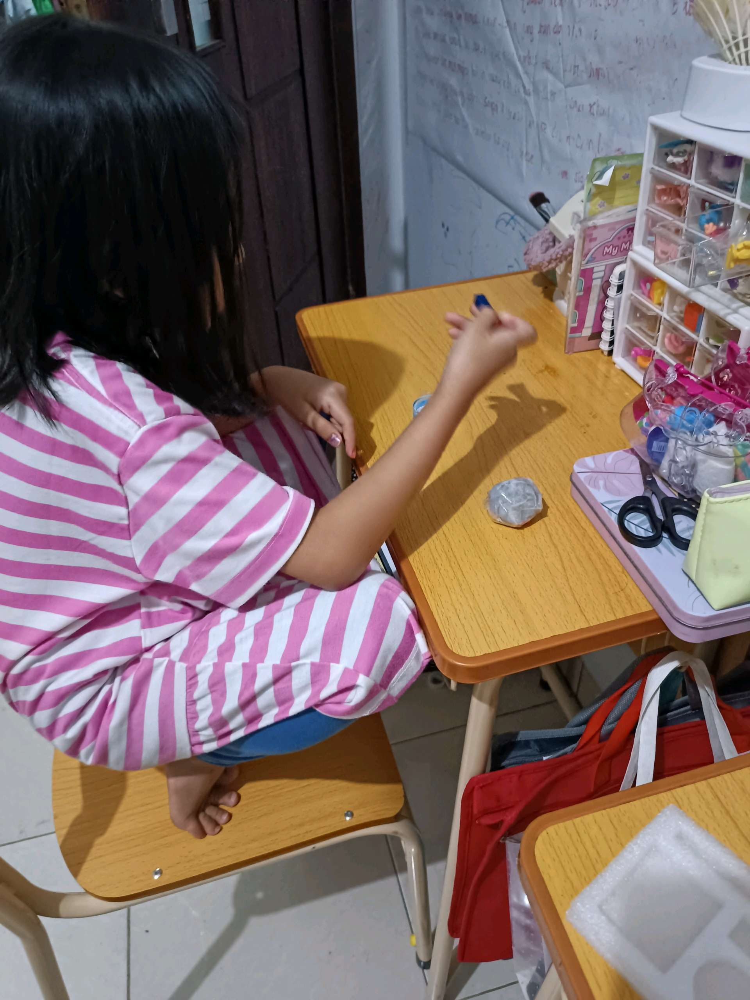
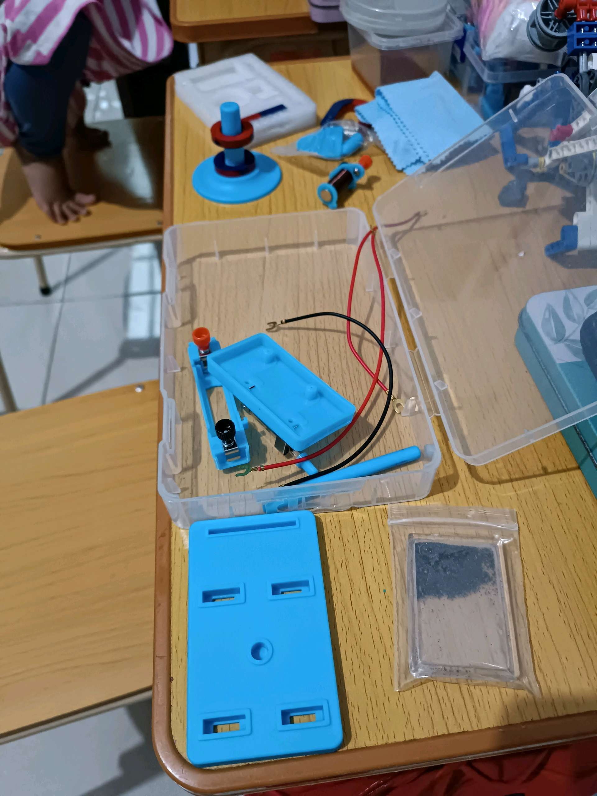

# 16 April 2026 - Log Kegiatan Harian
[Kembali](readme.md)

## 📌 Kegiatan
1. Kegiatan Utama:
   - Kegiatan: **Eksperimen sains — rangkaian listrik sederhana**. Abang merangkai sirkuit dasar menggunakan baterai, kabel merah-hitam, sakelar, dan komponen magnet/lilitan (elektromagnet). Latihan memahami aliran arus dan konsep elektromagnetisme.
   - Alat/bahan: kit eksperimen elektronik (baterai, kabel, sakelar, magnet, lilitan)
   - Durasi: -
2. Kegiatan Tambahan:
   - Kegiatan: Aktivitas craft di ruang belajar — keluarga membuat aksesori dari tali & manik-manik.
   - Alat/bahan: tali, manik-manik
   - Durasi: -

## 🎯 Capaian Kegiatan
- Memahami konsep dasar rangkaian listrik tertutup.
- Eksplorasi awal elektromagnetisme (interaksi arus listrik & magnet).

## 🚧 Kendala
- -

## 🖼️ Dokumentasi Kegiatan

[Kembali](readme.md)
