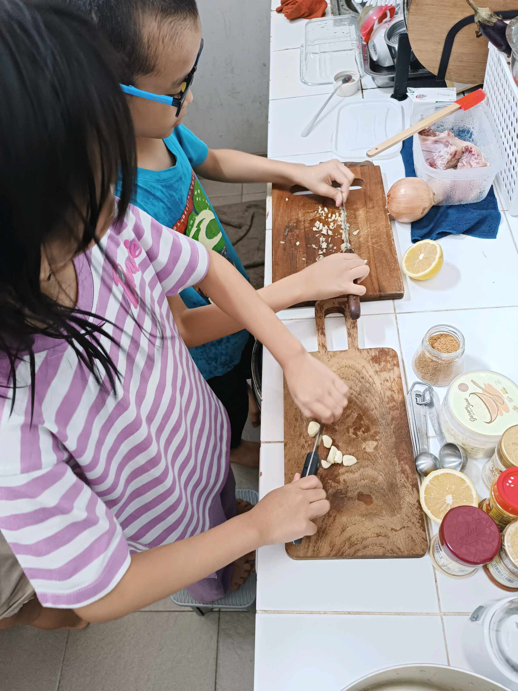
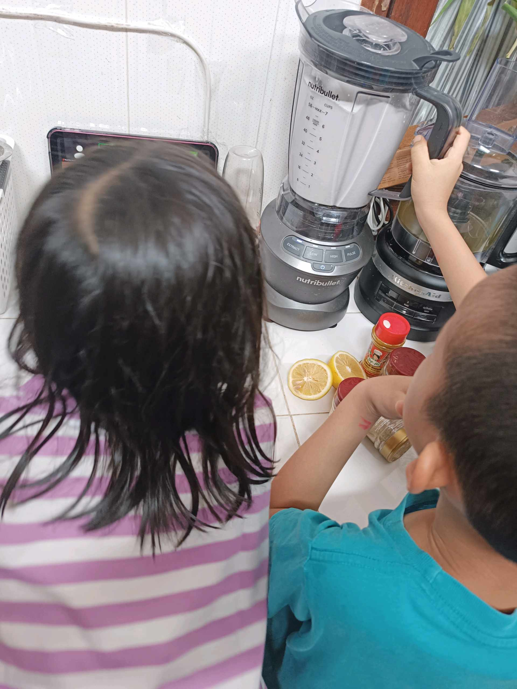
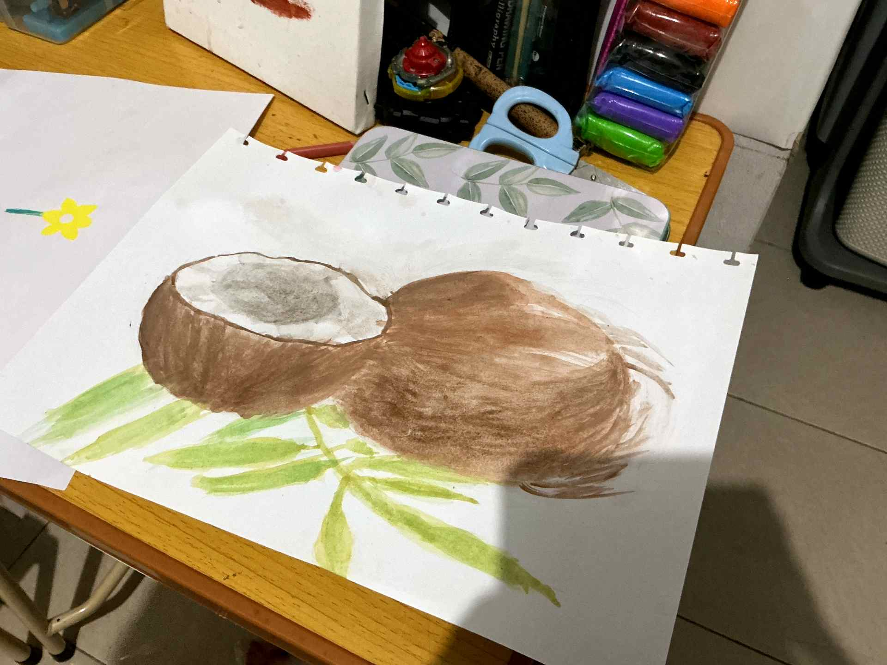

# 17 April 2026 - Log Kegiatan Harian
[Kembali](readme.md)

## 📌 Kegiatan
1. Kegiatan Utama:
   - Kegiatan: SC Cooking — memasak **ayam saus kari berbumbu kunyit dan cabai**, dengan plating disempurnakan lemon dan cabai hijau. Abang ikut prep bumbu (cincang bawang putih, jahe), mengoperasikan food processor NutriBullet untuk halus bumbu, dan memasak kuah kari. Latihan kuliner berbumbu kompleks.
   - Alat/bahan: ayam, kunyit, cabai, bawang putih, jahe, lemon, NutriBullet food processor, wajan, talenan
   - Durasi: -
2. Kegiatan Tambahan:
   - Kegiatan: SC Seni Lukis bersama Tante Dina — melukis cat air bertema **kelapa** (dua kelapa setengah dengan daun pelepah di bawahnya). Latihan teknik melukis tekstur kasar (sabut kelapa) dan gradasi coklat-hijau.
   - Alat/bahan: cat air, kuas, kertas lukis
   - Durasi: -

## 🎯 Capaian Kegiatan
- Menyelesaikan hidangan ayam saus kari dengan bumbu kompleks.
- Karya cat air kelapa selesai dengan tekstur sabut yang realistis.
- Latihan operasi food processor / blender khusus bumbu.

## 🚧 Kendala
- -

## 🖼️ Dokumentasi Kegiatan

[Kembali](readme.md)
