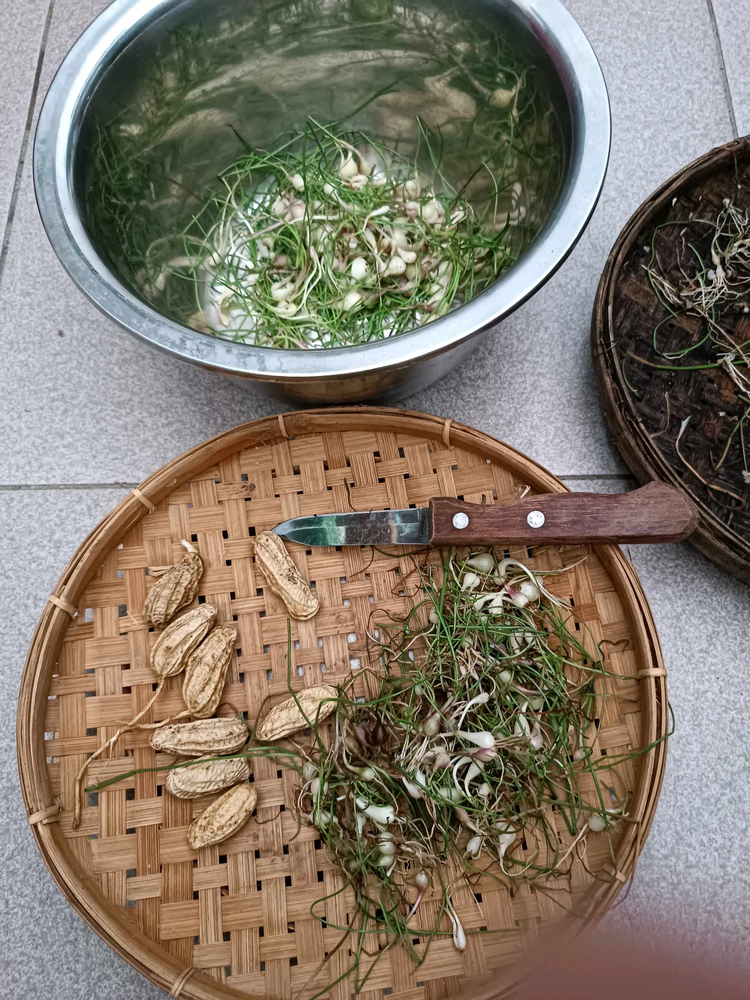
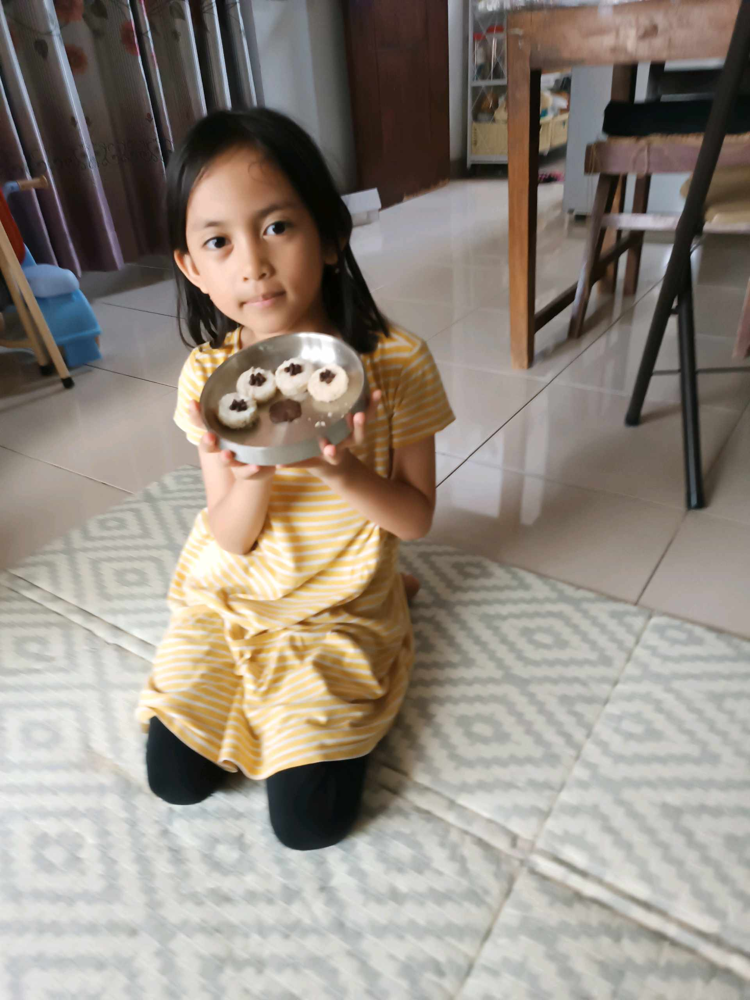

# 18 April 2026 - Log Kegiatan Harian
[Kembali](readme.md)

## 📌 Kegiatan
1. Kegiatan Utama:
   - Kegiatan: **SC online via iPad** bersama Umma — Abang mengenakan peci putih, mengikuti kelas Zoom dengan teman-teman dalam grid video sambil belajar dari buku tulis di samping. Suasana kelas kondusif di kamar.
   - Alat/bahan: iPad, buku tulis, peci
   - Durasi: -
2. Kegiatan Tambahan:
   - Kegiatan: **Panen kacang tanah** dari urban farming! Abang ikut mencabut tanaman kacang tanah dari pot, membersihkan polong-polong yang sudah berisi kacang, dan mencucinya. Hasil panen langsung dari kebun rumah.
   - Alat/bahan: tanaman kacang tanah, baskom air, pisau, tampah
   - Durasi: -

## 🎯 Capaian Kegiatan
- Konsisten mengikuti kelas online dengan etika dan fokus.
- **Panen kacang tanah pertama dari project urban farming** — siklus tanam-panen lengkap.

## 🚧 Kendala
- -

## 🖼️ Dokumentasi Kegiatan

[Kembali](readme.md)
