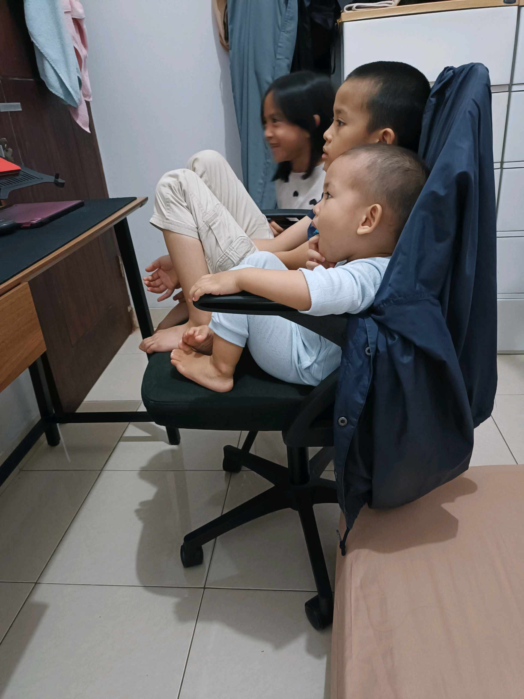
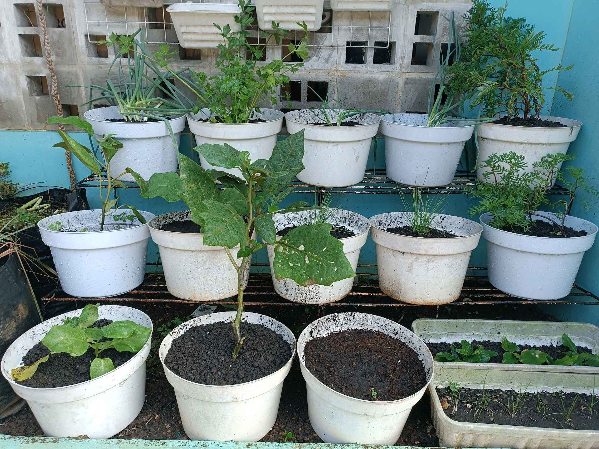

# 19 April 2026 - Log Kegiatan Harian
[Kembali](readme.md)

## 📌 Kegiatan
1. Kegiatan Utama:
   - Kegiatan: Family time — Abang duduk bertumpuk berbagi kursi dengan adik dan Aasiyah, menonton sesuatu bersama. Suasana akrab antar saudara.
2. Kegiatan Tambahan:
   - Kegiatan: Cek urban farming pagi/sore — barisan pot dengan terong, daun bawang, parsley, kacang tanah, dan tanaman baru tumbuh subur di rak.
   - Alat/bahan: -
   - Durasi: -

## 🎯 Capaian Kegiatan
- Bonding antar saudara di waktu istirahat.
- Konsistensi memantau kebun.

## 🚧 Kendala
- -

## 🖼️ Dokumentasi Kegiatan

[Kembali](readme.md)
