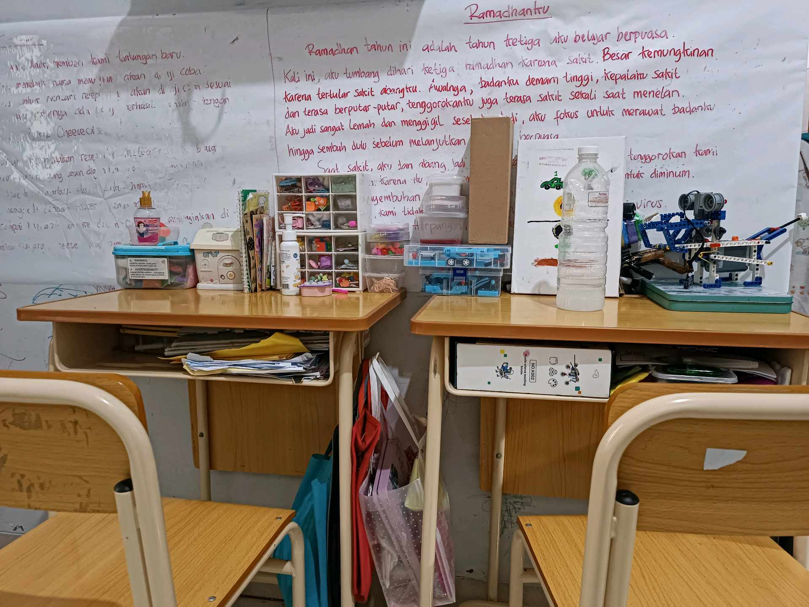
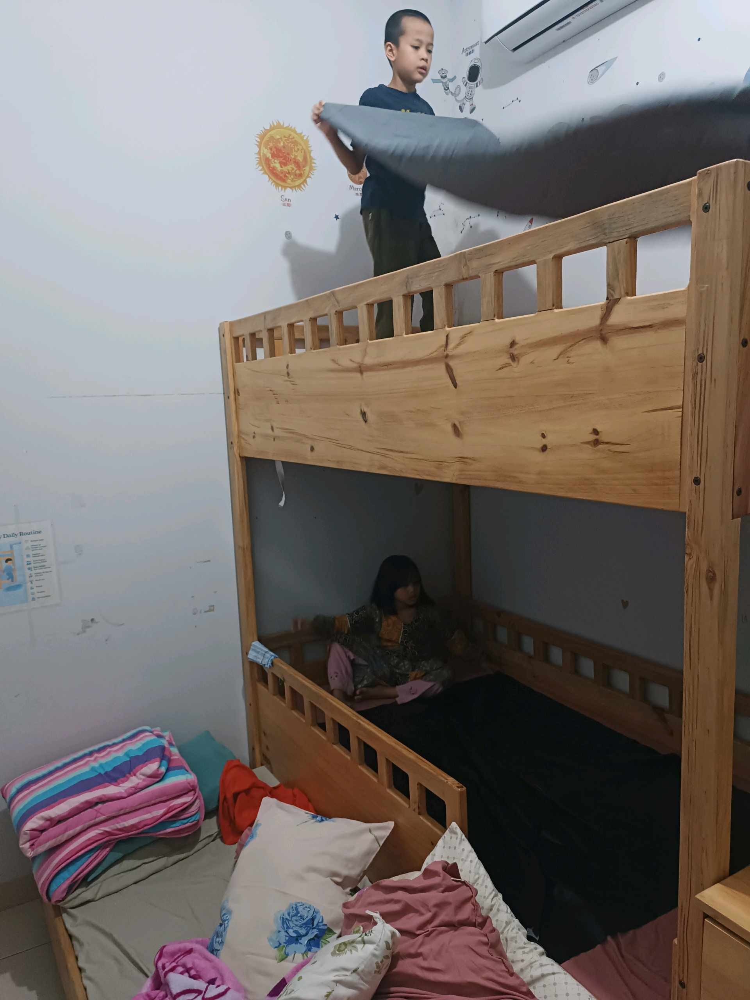

# 21 April 2026 - Log Kegiatan Harian
[Kembali](readme.md)

## 📌 Kegiatan
1. Kegiatan Utama:
   - Kegiatan: **Membaca cerita PDF "The Turtle and The Swans"** (fabel kura-kura dan angsa) di iPad — bacaan Bahasa Inggris dengan ilustrasi.
   - Alat/bahan: iPad, PDF cerita
   - Durasi: -
2. Kegiatan Tambahan:
   - Kegiatan: **Bersih-bersih kamar** — Abang merapikan kasur dan jemur bantal/seprai di tempat tidur tingkat atas. Adik duduk tenang di tempat tidur bawah. Tanggung jawab merapikan tempat tidur sendiri.
   - Alat/bahan: bantal, seprai
   - Durasi: -

## 🎯 Capaian Kegiatan
- Literasi cerita Bahasa Inggris lewat media digital.
- Kemandirian merapikan tempat tidur.

## 🚧 Kendala
- -

## 🖼️ Dokumentasi Kegiatan

[Kembali](readme.md)
