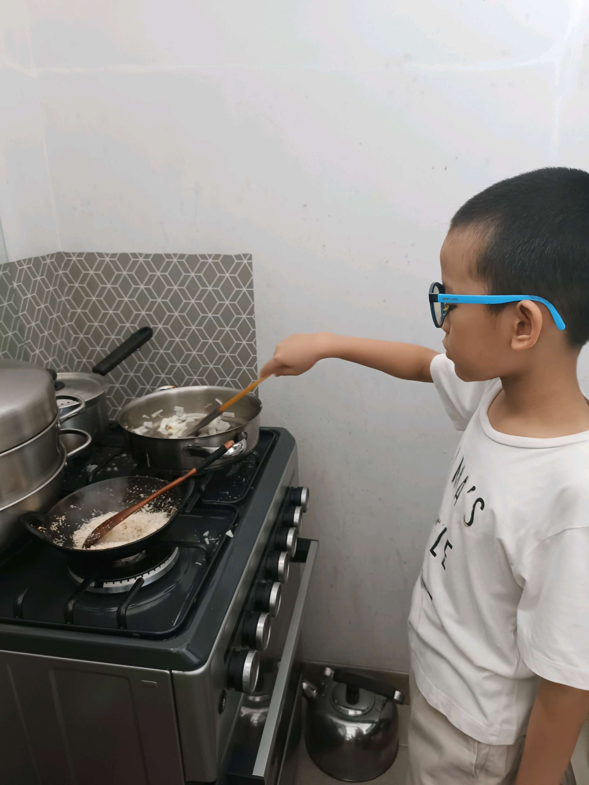
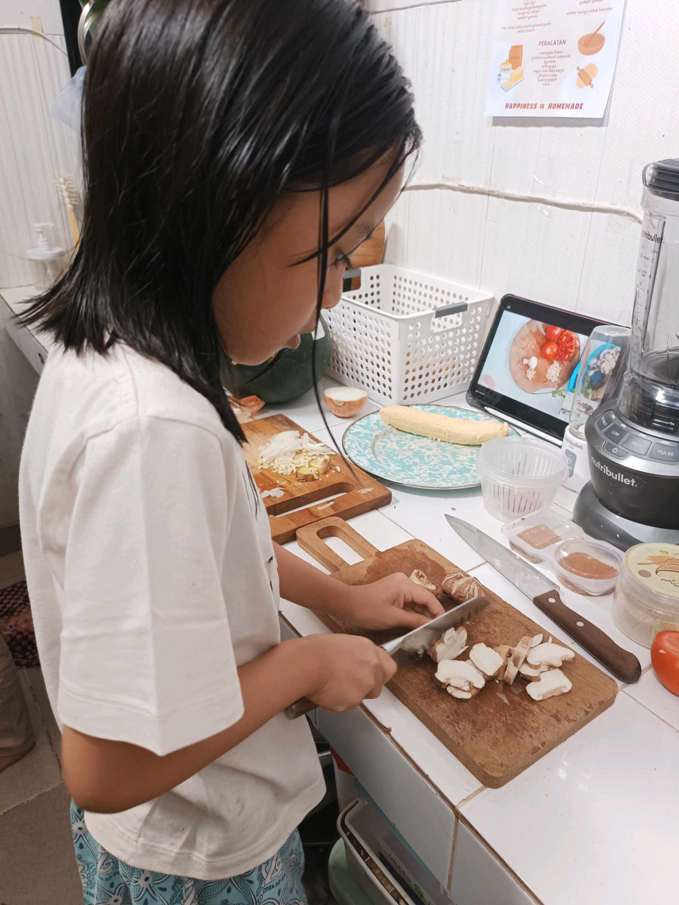

# 24 April 2026 - Log Kegiatan Harian
[Kembali](readme.md)

## 📌 Kegiatan
1. Kegiatan Utama:
   - Kegiatan: **SC Cooking — sesi dua hidangan**: (1) ayam stew kuah merah bertomat dengan kentang, dan (2) granola bar / energy bar dengan topping wijen hitam. Abang fokus di kompor — mengaduk kuah stew dan menumis serundeng kelapa di wajan. Latihan multitasking dapur.
   - Alat/bahan: ayam, tomat, kentang, serundeng kelapa, oat, wijen hitam, panci, wajan, kompor, talenan, pisau
   - Durasi: -

## 🎯 Capaian Kegiatan
- Mengelola dua masakan paralel di kompor sekaligus (multitasking).
- Membuat camilan sehat sendiri (granola bar dengan wijen hitam).

## 🚧 Kendala
- -

## 🖼️ Dokumentasi Kegiatan

[Kembali](readme.md)
