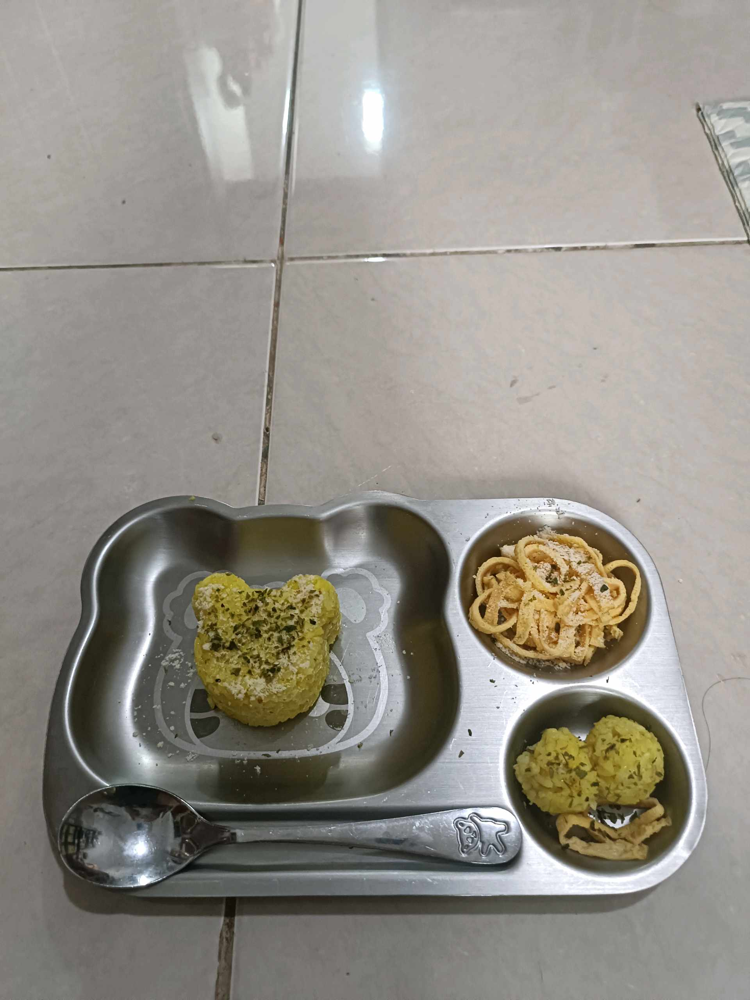
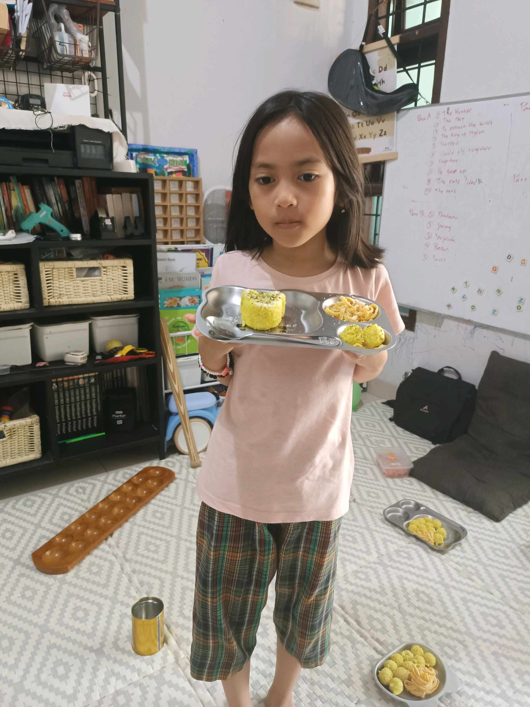

# 25 April 2026 - Log Kegiatan Harian
[Kembali](readme.md)

## 📌 Kegiatan
1. Kegiatan Utama:
   - Kegiatan: **Menyiapkan bento beruang** — nasi kuning/nasi cetak dengan parsley di atasnya (cetakan bear), pasta kuning mie (mac and cheese atau yakisoba), dan tumis enoki dengan jamur. Plating rapi di nampan stainless beruang.
   - Alat/bahan: nasi, parsley, pasta, jamur enoki, cetakan beruang, nampan
   - Durasi: -

## 🎯 Capaian Kegiatan
- Belajar plating bento dengan estetika lucu untuk anak.
- Memahami komposisi gizi seimbang dalam satu nampan (karbo + protein + sayur).

## 🚧 Kendala
- -

## 🖼️ Dokumentasi Kegiatan

[Kembali](readme.md)
