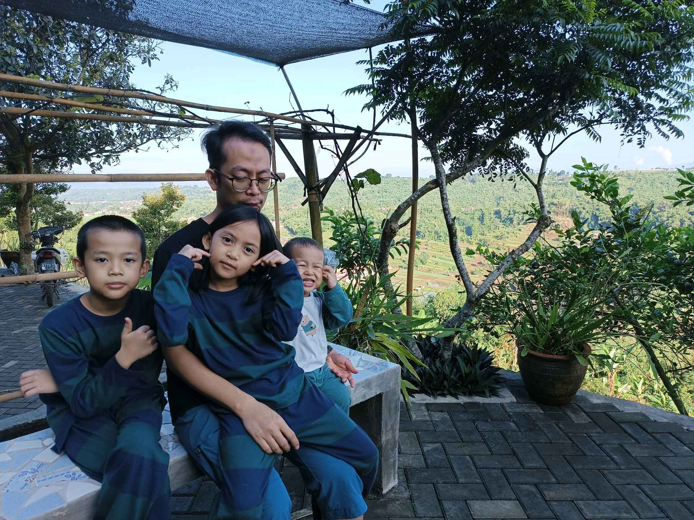
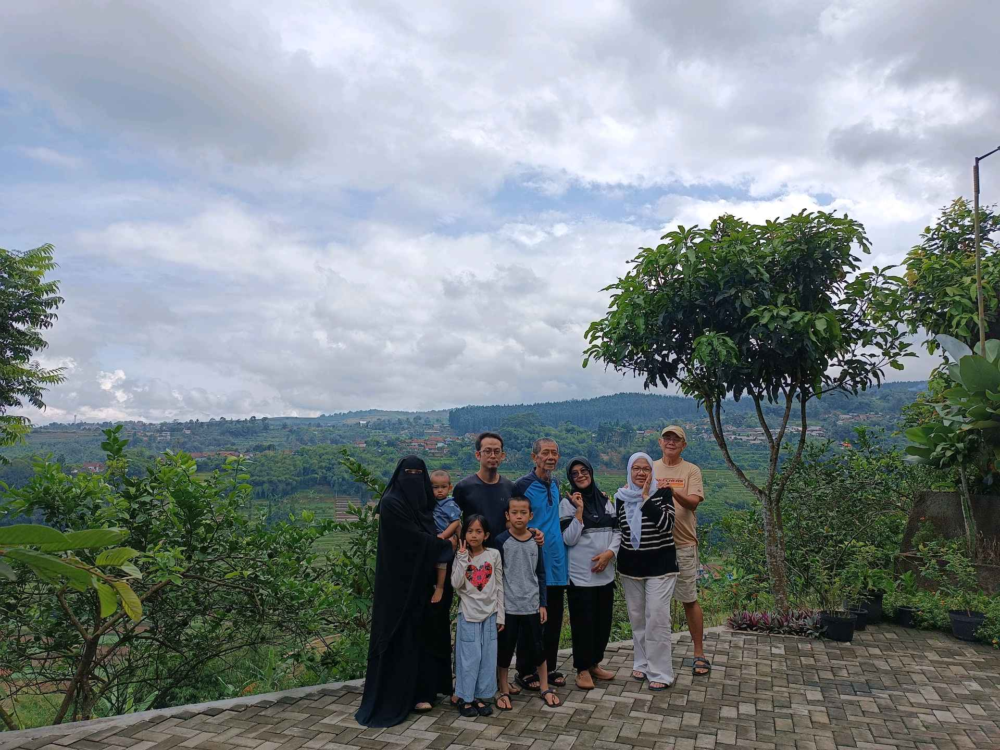
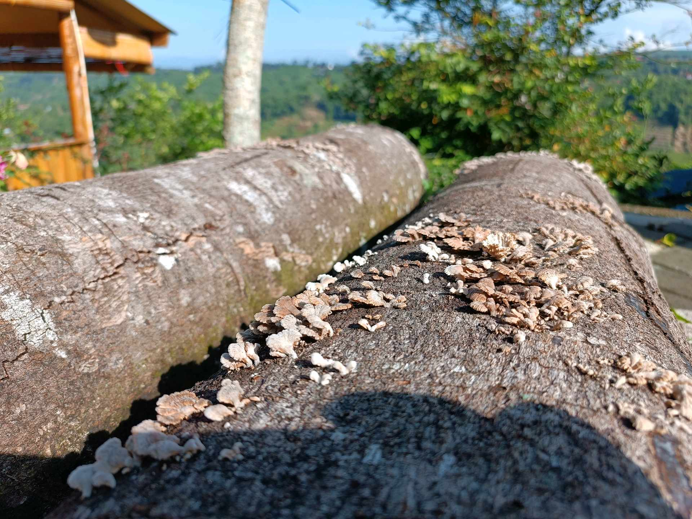

# 1 Mei 2026 - Log Kegiatan Harian
[Kembali](readme.md)

## 📌 Kegiatan
1. Kegiatan Utama:
   - Kegiatan: **Quality time keluarga di Sukabumi** — Abang berfoto bersama Baba, Aasiyah, dan adik di gazebo dengan pemandangan luas sawah dan bukit hijau. Sore hari duduk di tepi terrace memandangi hamparan rice terraces. Group photo bersama Nyai, Yai, Umma, dan saudara.
2. Kegiatan Tambahan:
   - Kegiatan: **Observasi alam** — Abang mengamati batang pohon yang ditumbuhi jamur kayu (white fungi/oyster-like). Belajar tentang ekosistem pohon dan organisme dekomposer.
   - Alat/bahan: -
   - Durasi: -

## 🎯 Capaian Kegiatan
- Bonding keluarga tiga generasi (Nyai-Yai-Umma-Baba-anak).
- Observasi sains: jamur kayu sebagai bagian dari siklus dekomposisi alam.
- Apresiasi keindahan alam pedesaan Sukabumi.

## 🚧 Kendala
- -

## 🖼️ Dokumentasi Kegiatan

[Kembali](readme.md)
