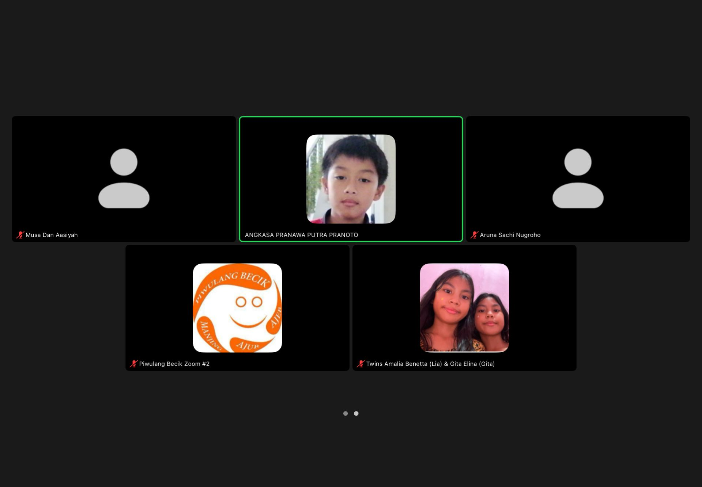

# 27 April 2026 - Log Kegiatan Harian
[Kembali](readme.md)

## 📌 Kegiatan
1. Kegiatan Utama:
   - Kegiatan: **SC Bahasa Jawa via Zoom "Piwulang Becik #2"** — kelas online bersama teman-teman (Angkasa, Aruna, twins Lia & Gita). Belajar muatan lokal Bahasa Jawa dengan konsep "piwulang becik" (ajaran kebaikan).
   - Alat/bahan: iPad/laptop, Zoom
   - Durasi: -

## 🎯 Capaian Kegiatan
- Konsisten mengikuti kelas Bahasa Jawa online.
- Pengenalan ajaran kebaikan tradisional (piwulang becik).

## 🚧 Kendala
- -

## 🖼️ Dokumentasi Kegiatan

[Kembali](readme.md)
