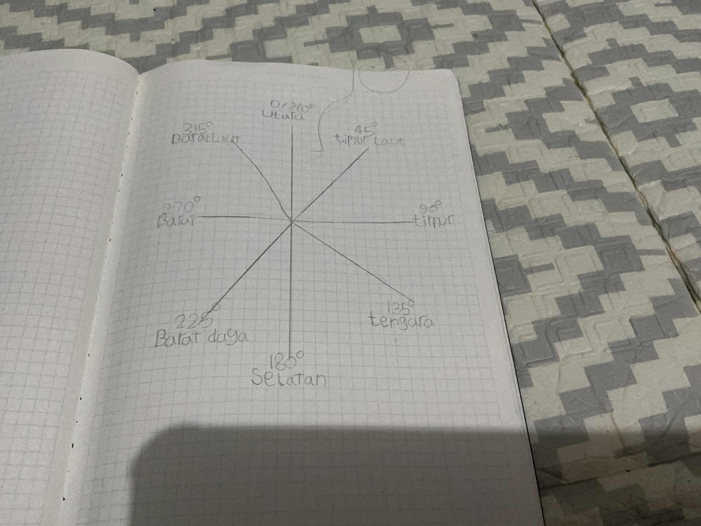
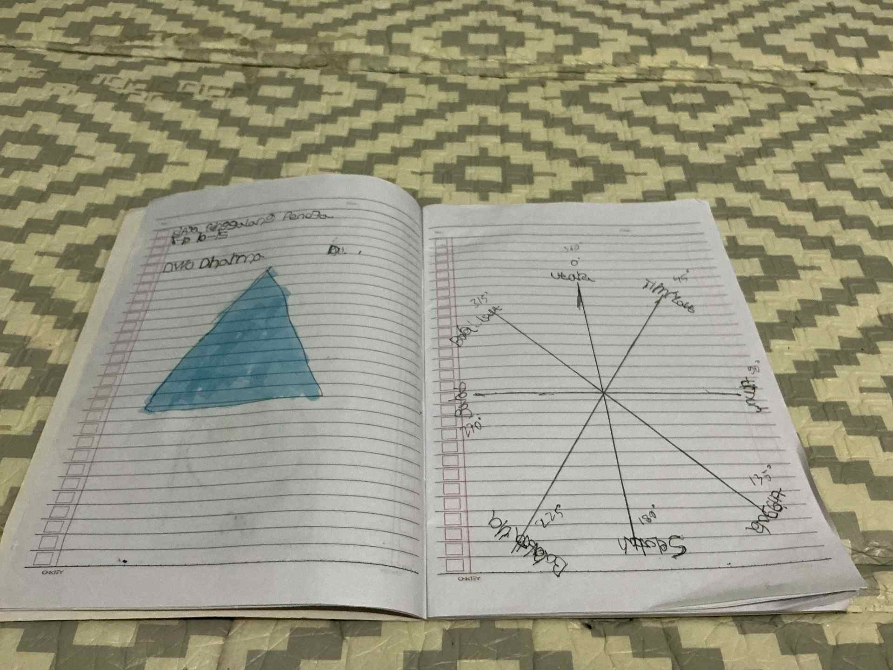

# 28 April 2026 - Log Kegiatan Harian
[Kembali](readme.md)

## 📌 Kegiatan
1. Kegiatan Utama:
   - Kegiatan: **Materi Kepramukaan** — Abang belajar dan mencatat di buku tulisnya: (1) **denah arah** sederhana (peta dengan rumah, masjid, Alfamart, jalan & arah selatan/jurus ketepan); (2) **8 arah mata angin lengkap dengan derajatnya** (Utara 0°/360°, Timur Laut 45°, Timur 90°, Tenggara 135°, Selatan 180°, Barat Daya 225°, Barat 270°, Barat Laut 315°); (3) **tingkatan pramuka** beserta rentang usianya: Siaga (7–10), Penggalang (11–15), Penegak (16–20), Pandega.
   - Alat/bahan: buku tulis, pensil, pulpen warna
   - Durasi: -

## 🎯 Capaian Kegiatan
- Memahami sistem 8 arah mata angin lengkap dengan derajat.
- Mengenal tingkatan kepramukaan (Siaga, Penggalang, Penegak, Pandega) dan rentang usianya.
- Praktik membuat denah lokasi sederhana (kontekstual sekitar rumah).

## 🚧 Kendala
- -

## 🖼️ Dokumentasi Kegiatan

[Kembali](readme.md)
