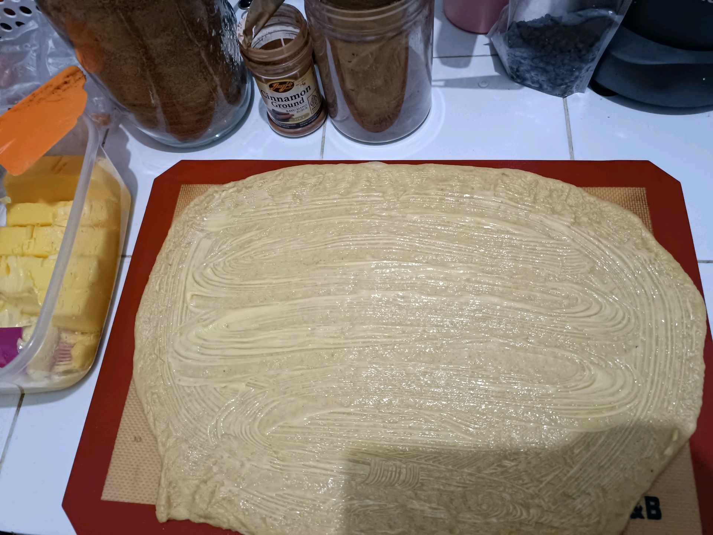

# 29 April 2026 - Log Kegiatan Harian
[Kembali](readme.md)

## 📌 Kegiatan
1. Kegiatan Utama:
   - Kegiatan: **Menyiapkan bekal perjalanan dan membuat roti** — malamnya, Abang ikut packing keperluan liburan dan membantu di dapur membuat adonan roti gulung kayu manis (cinnamon roll) dengan teknik **laminated dough** (lipatan butter di antara lapisan adonan) yang akan dibawa untuk liburan bersama Nyai dan Yai ke Sukabumi.
   - Alat/bahan: tepung, butter, cinnamon ground, gula, Silpat baking mat, rolling pin
   - Durasi: -

## 🎯 Capaian Kegiatan
- Latihan teknik laminasi adonan (mirip teknik croissant 13 Februari) untuk hasil roti berlapis.
- Persiapan mandiri sebelum perjalanan keluarga.

## 🚧 Kendala
- -

## 🖼️ Dokumentasi Kegiatan

[Kembali](readme.md)
