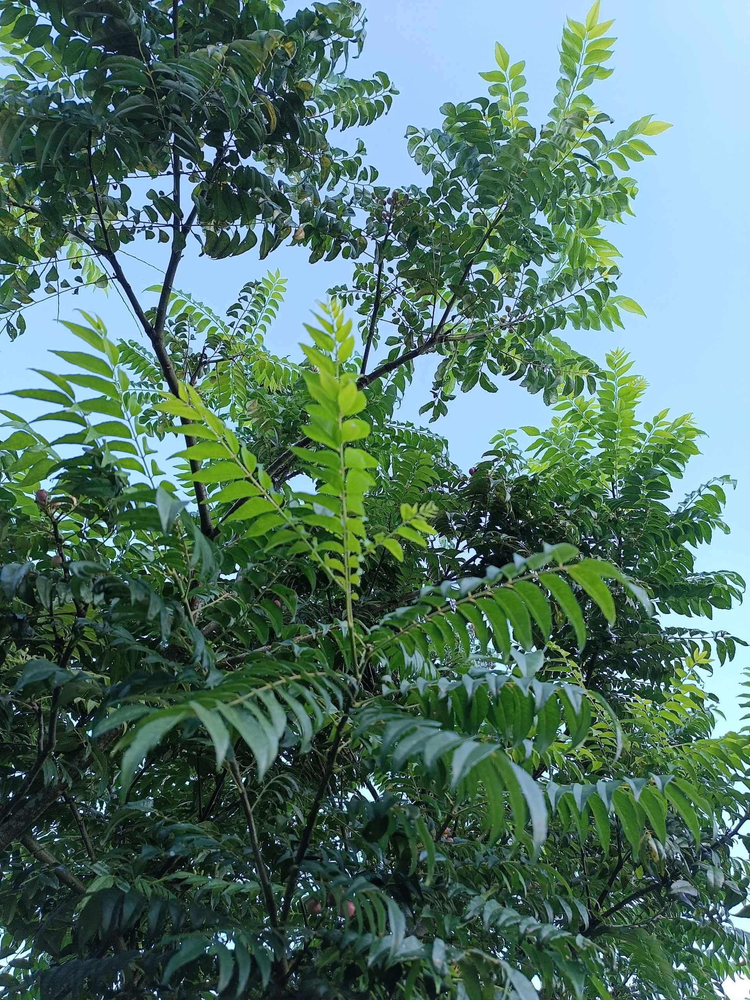

# 30 April 2026 - Log Kegiatan Harian
[Kembali](readme.md)

## 📌 Kegiatan
1. Kegiatan Utama:
   - Kegiatan: **Liburan keluarga di Sukabumi** bersama Nyai dan Yai. Abang mengamati kebun bunga **hydrangea biru besar**, bunga lily putih, dan daun keladi merah di halaman; juga menengadah memperhatikan pohon-pohon rindang. Eksplorasi alam pegunungan.
   - Alat/bahan: -
   - Durasi: -

## 🎯 Capaian Kegiatan
- Observasi botanikal: mengenal bunga hydrangea, lily, dan pohon rindang khas dataran tinggi.
- Apresiasi alam dan udara segar pegunungan.

## 🚧 Kendala
- -

## 🖼️ Dokumentasi Kegiatan

[Kembali](readme.md)
