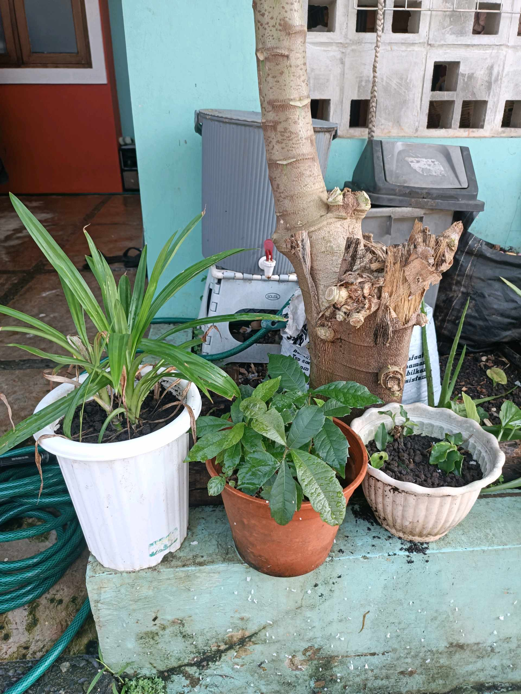

# 4 Mei 2026 - Log Kegiatan Harian
[Kembali](readme.md)

## 📌 Kegiatan
1. Kegiatan Utama:
   - Kegiatan: **Cek urban farming setelah liburan** — Abang memeriksa kondisi semua tanaman setelah ditinggal beberapa hari ke Sukabumi. Hasil: **tanaman terong sudah berbunga ungu kecil** (siklus reproduksi mulai), kacang tanah & daun bawang tetap subur, ada beberapa pot baru dengan tanaman pakis dan upcycle batang pohon kering sebagai dekorasi.
   - Alat/bahan: -
   - Durasi: -

## 🎯 Capaian Kegiatan
- Pengamatan tahap baru siklus tanaman: **terong berbunga** sebagai indikator akan berbuah.
- Konsistensi merawat kebun walau ditinggal liburan.

## 🚧 Kendala
- -

## 🖼️ Dokumentasi Kegiatan

[Kembali](readme.md)
