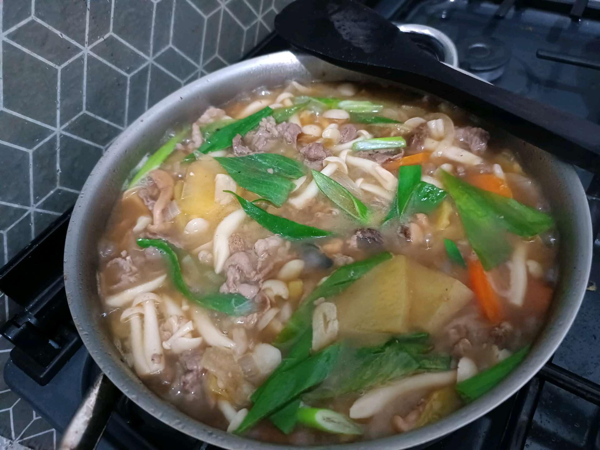
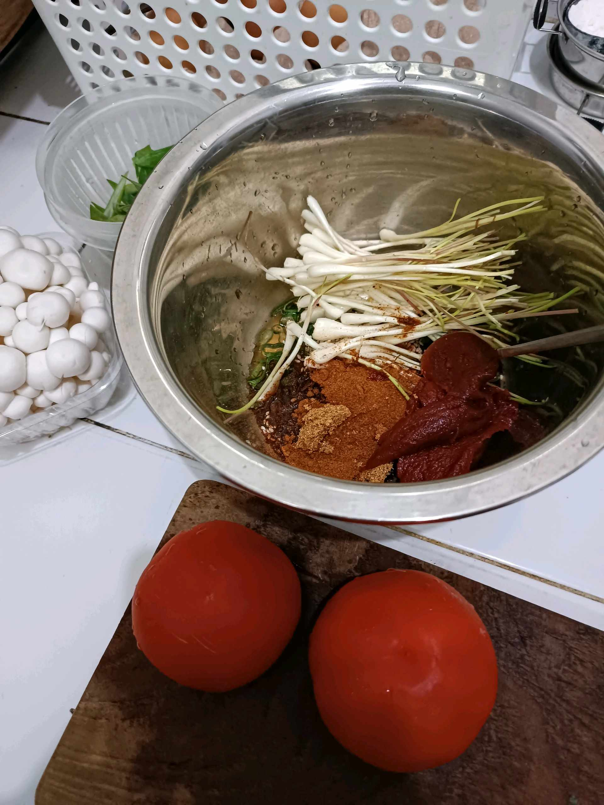
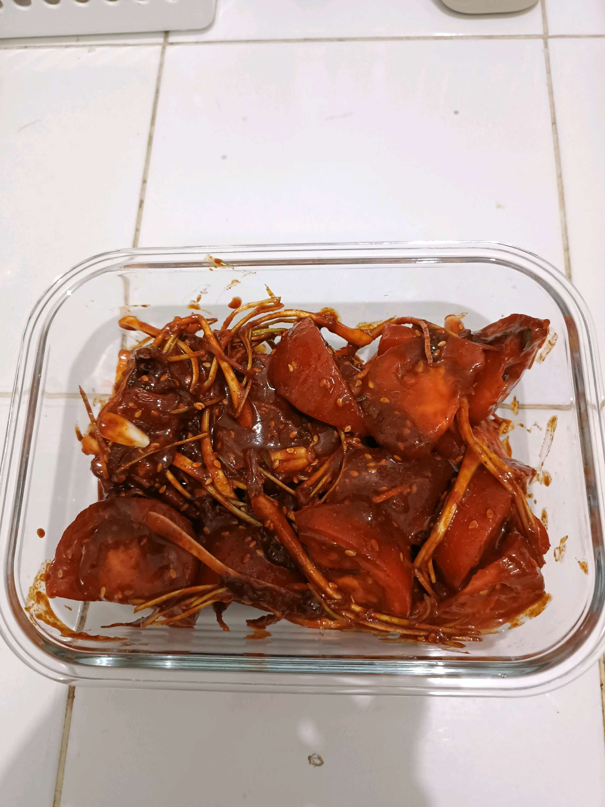

# 5 Mei 2026 - Log Kegiatan Harian
[Kembali](readme.md)

## 📌 Kegiatan
1. Kegiatan Utama:
   - Kegiatan: **SC Cooking — sesi dua hidangan Asia**: (1) **udon soup Jepang** dengan irisan daging sapi, jamur enoki & shimeji, lobak, wortel, dan daun bawang dalam kuah bening berbumbu; (2) **tomat-enoki braised gaya Korea/Jepang** dengan saus merah pedas (sambal/gochujang).
   - Alat/bahan: udon, daging sapi, enoki, shimeji, wortel, lobak, daun bawang, tomat, gochujang/sambal, panci, wajan
   - Durasi: -

## 🎯 Capaian Kegiatan
- Mengenal hidangan udon Jepang sebagai sup mie kompleks.
- Eksplorasi rasa baru: kombinasi tomat–jamur dengan saus pedas khas Asia Timur.

## 🚧 Kendala
- -

## 🖼️ Dokumentasi Kegiatan

[Kembali](readme.md)
