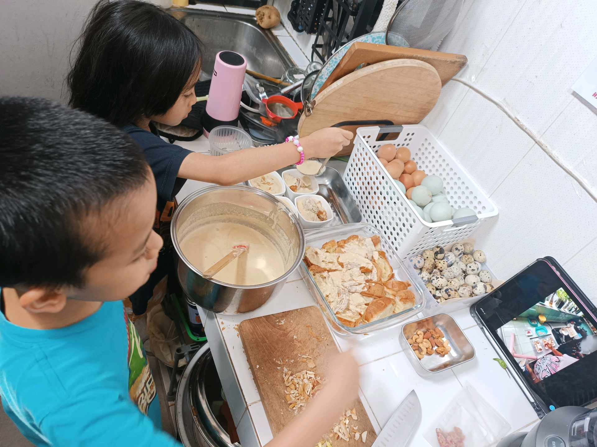
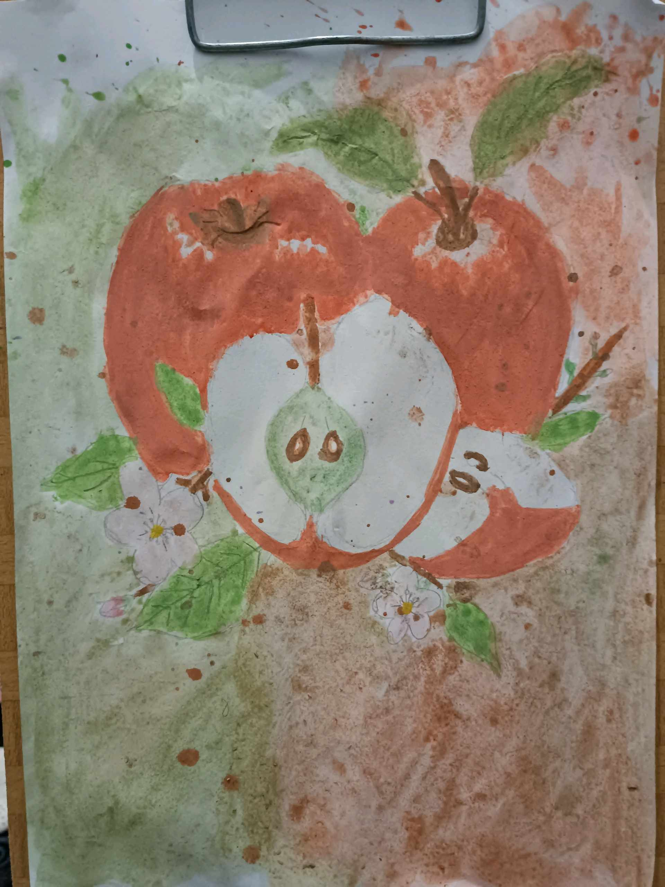

# 8 Mei 2026 - Log Kegiatan Harian
[Kembali](readme.md)

## 📌 Kegiatan
1. Kegiatan Utama:
   - Kegiatan: **Project konstruksi model figure** — Abang merakit action figure putih bersayap mekanis lengkap dengan pedang dan stand display (gunpla / model kit). Latihan ketelitian merakit komponen kecil dan mengikuti instruksi visual.
   - Alat/bahan: model kit (gunpla/figure), stand display
   - Durasi: -
2. Kegiatan Tambahan:
   - Kegiatan: **SC Cooking — bread pudding** dengan kismis dan kacang almond, disajikan dengan saus susu. Abang menyuwir roti, sementara Aasiyah menakar bahan dengan referensi resep video di iPad.
   - Alat/bahan: roti, telur (ayam & puyuh), susu, kismis, almond, loyang oven
   - Durasi: -
3. Kegiatan Tambahan:
   - Kegiatan: **SC Seni Lukis** — melukis cat air bertema **apel** (dua apel merah utuh + satu apel terbelah memperlihatkan biji & isi putih, dengan bunga apel kecil dan daun di sekitar). Latihan komposisi still life dengan splatter background.
   - Alat/bahan: cat air, kuas, kertas lukis
   - Durasi: -

## 🎯 Capaian Kegiatan
- Menyelesaikan rakitan model figure dengan stand display.
- Membuat bread pudding dari nol; latihan kerja sama di dapur dengan saudara.
- Karya cat air apel (still life) selesai dengan detail biji dan komposisi splatter.

## 🚧 Kendala
- -

## 🖼️ Dokumentasi Kegiatan

[Kembali](readme.md)
