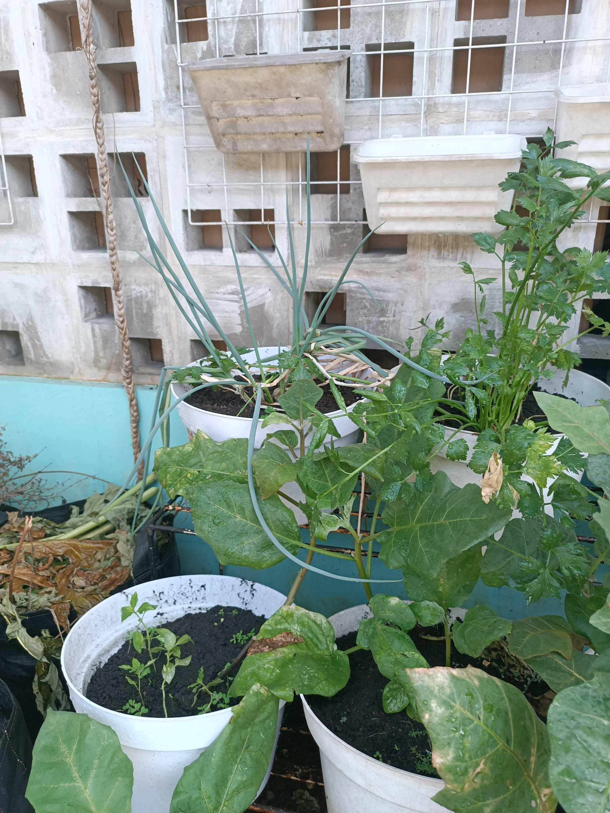
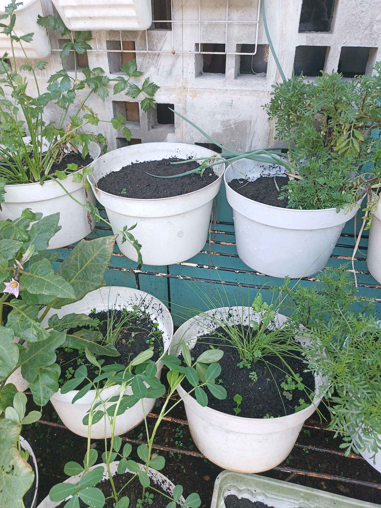
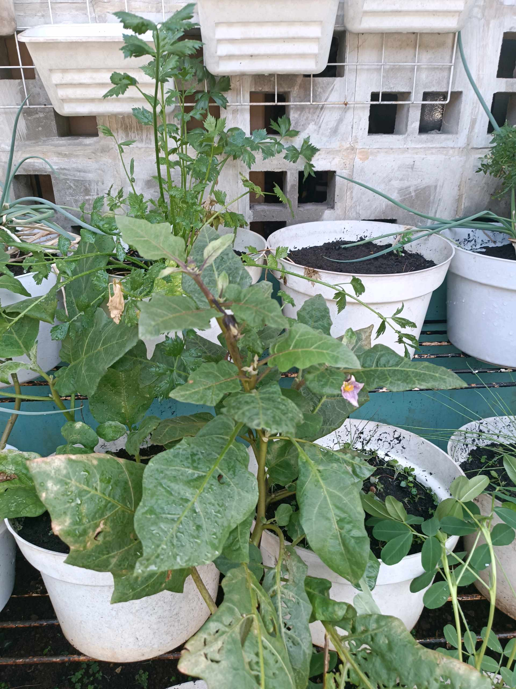

# 11 Mei 2026 - Log Kegiatan Harian
[Kembali](readme.md)

## 📌 Kegiatan
1. Kegiatan Utama:
   - Kegiatan: **Cek urban farming pekanan** — Abang memantau seluruh rak pot di kebun samping. Terong masih berbunga ungu (menunggu fase berbuah), kacang tanah & parsley tumbuh subur, daun bawang panjang siap dipanen, ada pot baru dengan benih tanaman aromatik.
   - Alat/bahan: -
   - Durasi: -

## 🎯 Capaian Kegiatan
- Konsistensi memantau pertumbuhan kebun.
- Pengamatan fase reproduksi tanaman (bunga terong → menunggu pembentukan buah).

## 🚧 Kendala
- -

## 🖼️ Dokumentasi Kegiatan

[Kembali](readme.md)
