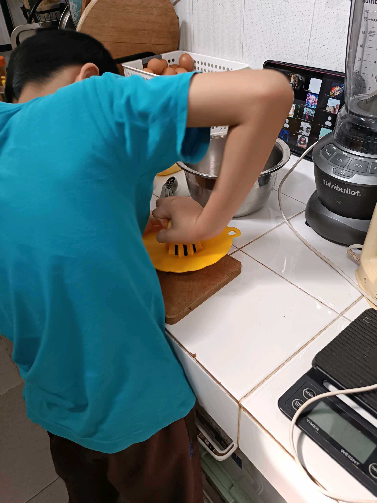
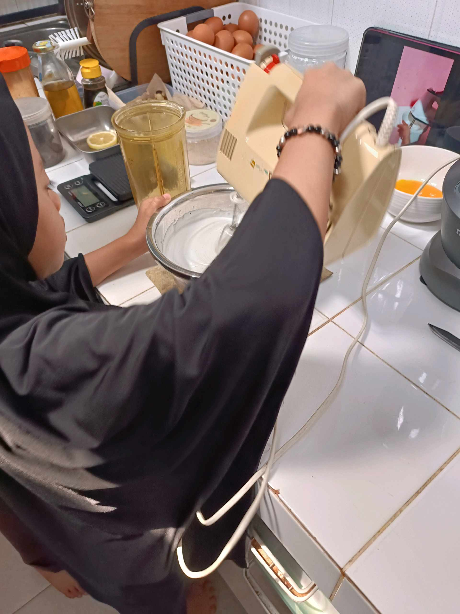

# 15 Mei 2026 - Log Kegiatan Harian
[Kembali](readme.md)

## 📌 Kegiatan
1. Kegiatan Utama:
   - Kegiatan: **SC Cooking — Mini Pavlova dengan Lemon Curd**. Abang memeras lemon dengan citrus juicer untuk membuat lemon curd, lalu ikut mengocok adonan putih telur (meringue) dengan hand mixer sampai kaku (stiff peak). Hasil akhir: mini meringue tarts berbentuk sarang dengan topping lemon curd kuning, blueberry, dan daun mint hijau — disajikan dengan rapi.
   - Alat/bahan: putih telur, gula, lemon, blueberry, daun mint, hand mixer, citrus juicer, loyang, oven
   - Durasi: -

## 🎯 Capaian Kegiatan
- Memahami teknik dasar meringue (mengocok putih telur sampai kaku).
- Membuat lemon curd dari nol dengan lemon segar.
- Plating dessert kelas resto: mini pavlova dengan topping berlapis.

## 🚧 Kendala
- -

## 🖼️ Dokumentasi Kegiatan

[Kembali](readme.md)
