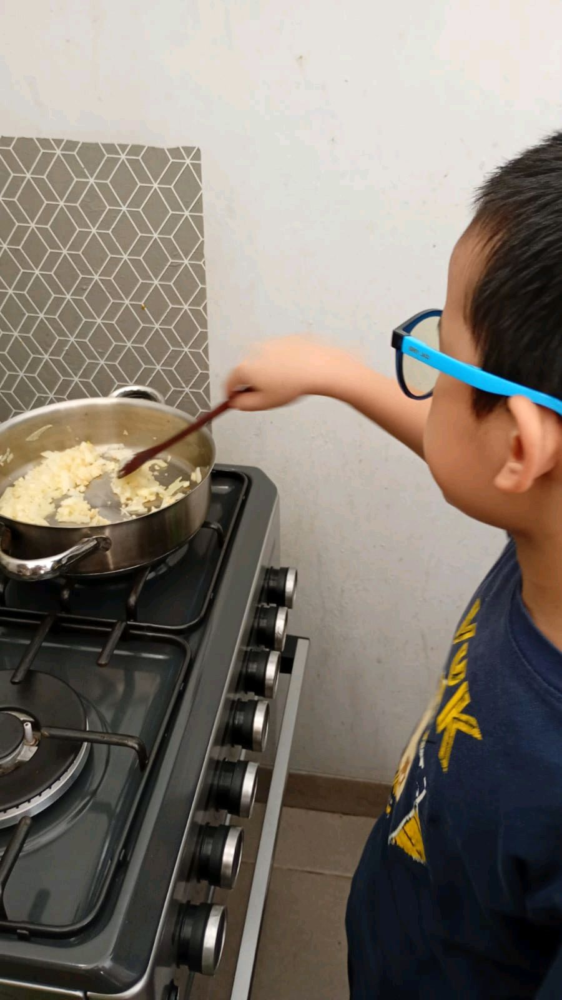
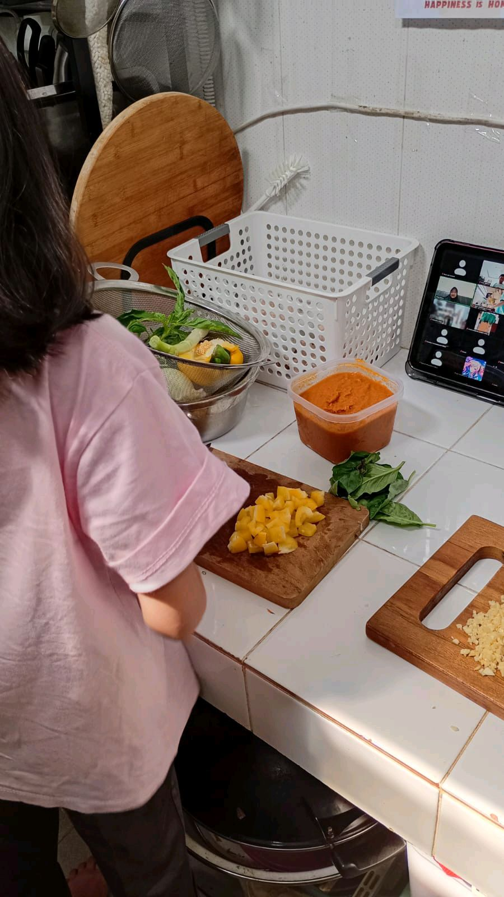

# 20 Mei 2026 - Log Kegiatan Harian
[Kembali](readme.md)

## 📌 Kegiatan
1. Kegiatan Utama:
   - Kegiatan: **SC Cooking — Shakshuka** (hidangan khas Timur Tengah/Afrika Utara: telur poached dalam saus tomat berbumbu dengan daun basil). Abang fokus di kompor menumis bawang putih dan bawang bombay sebagai dasar saus, sambil Aasiyah cincang bahan & operasikan iPad untuk resep. Hasil akhir: panci besar shakshuka dengan telur cantik di permukaan tomato sauce, ditaburi daun basil segar.
   - Alat/bahan: telur, tomat, bawang putih, bawang bombay, paprika, daun basil, panci besar, kompor
   - Durasi: -

## 🎯 Capaian Kegiatan
- Mengenal hidangan **Shakshuka** sebagai sarapan tradisional Mediterania/Timur Tengah.
- Latihan teknik **poach egg** di atas saus (egg crackling onto sauce).
- Latihan menumis aromatik dengan kontrol api.

## 🚧 Kendala
- -

## 🖼️ Dokumentasi Kegiatan

[Kembali](readme.md)
