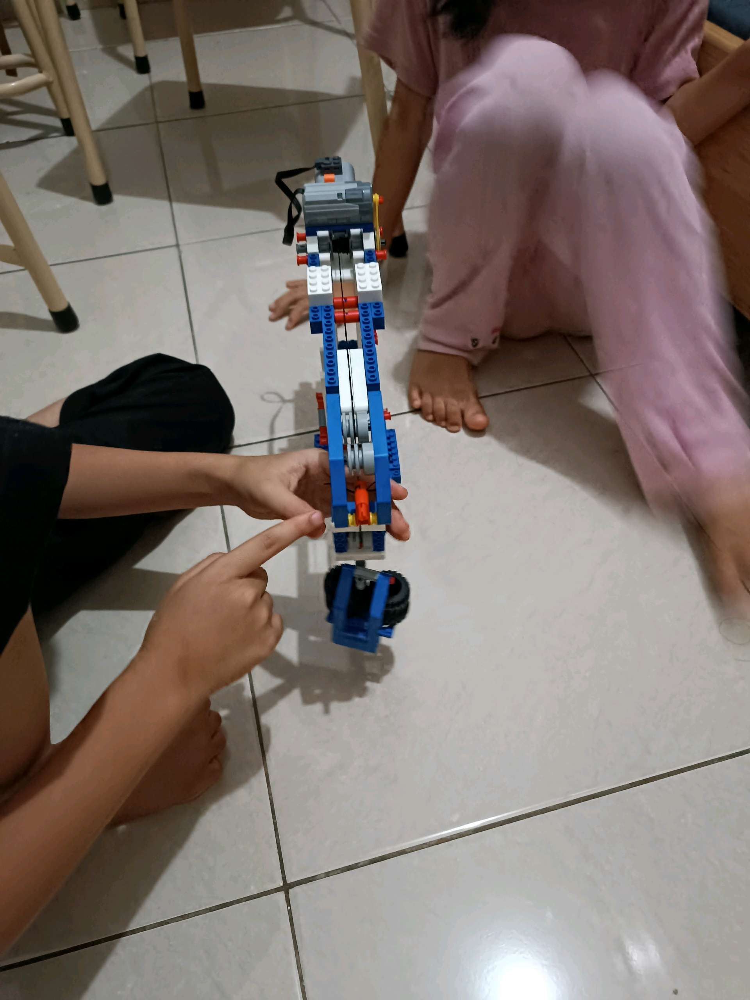

# 22 Mei 2026 - Log Kegiatan Harian
[Kembali](readme.md)

## 📌 Kegiatan
1. Kegiatan Utama:
   - Kegiatan: **Project konstruksi LEGO Crane (lanjutan)** — Abang mendemonstrasikan mekanisme katrol majemuk pada crane LEGO miliknya, dengan beban roda yang menggantung pada tali. Eksplorasi prinsip fisika sederhana (mechanical advantage) lewat permainan konstruksi.
   - Alat/bahan: LEGO Technic crane, beban roda
   - Durasi: -

## 🎯 Capaian Kegiatan
- Pendalaman konsep katrol majemuk dan keseimbangan beban.
- Lanjutan project konstruksi yang sudah berjalan dari periode sebelumnya.

## 🚧 Kendala
- -

## 🖼️ Dokumentasi Kegiatan

[Kembali](readme.md)
