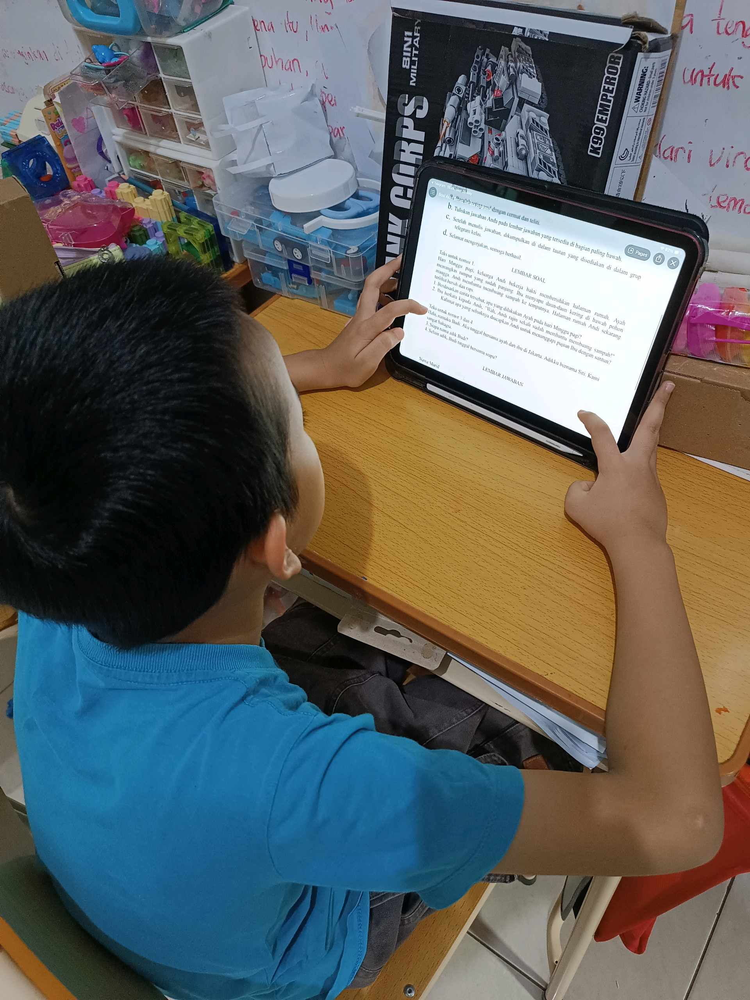
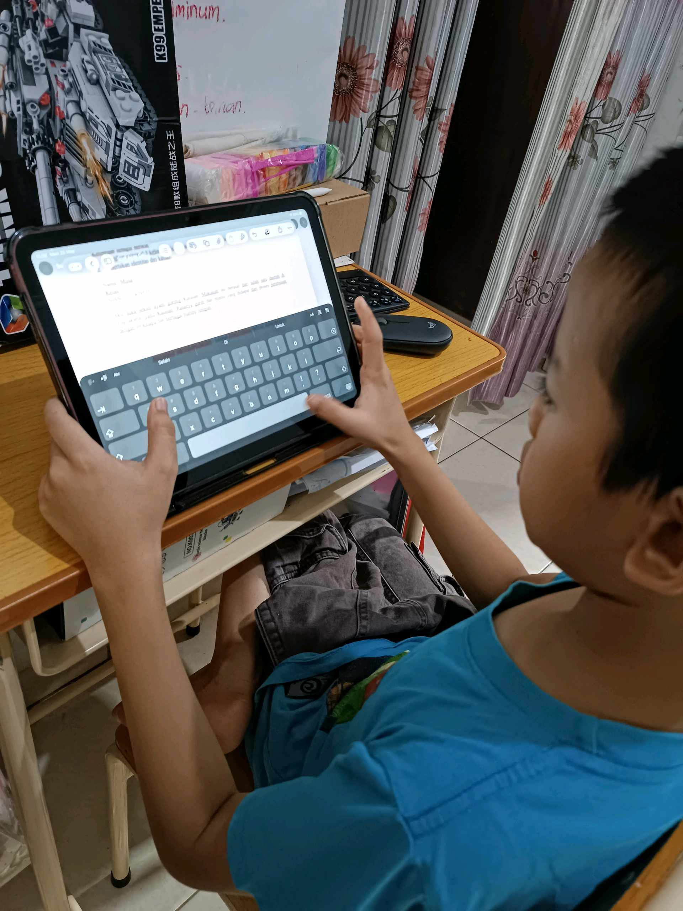

# 25 Mei 2026 - Log Kegiatan Harian
[Kembali](readme.md)

## 📌 Kegiatan
1. Kegiatan Utama:
   - Kegiatan: **Literasi digital — membaca + mengetik di iPad**. Abang membaca dokumen/PDF (buku LEGO Star Wars sebagai bacaan ringan), lalu beralih ke mode mengetik dengan keyboard virtual untuk menulis (kemungkinan latihan menulis atau menjawab pertanyaan).
2. Kegiatan Tambahan:
   - Kegiatan: Aasiyah ikut bergabung mengamati materi di iPad bersama Abang — bonding antar saudara di ruang belajar.
   - Alat/bahan: iPad
   - Durasi: -

## 🎯 Capaian Kegiatan
- Latihan literasi digital: membaca + mengetik di tablet.
- Berbagi alat belajar dengan saudara.

## 🚧 Kendala
- -

## 🖼️ Dokumentasi Kegiatan

[Kembali](readme.md)
