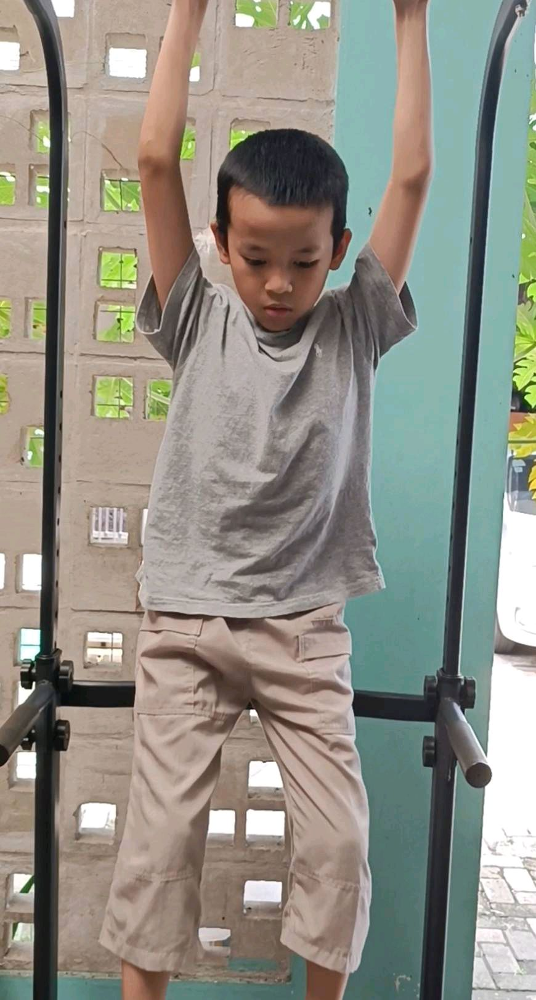
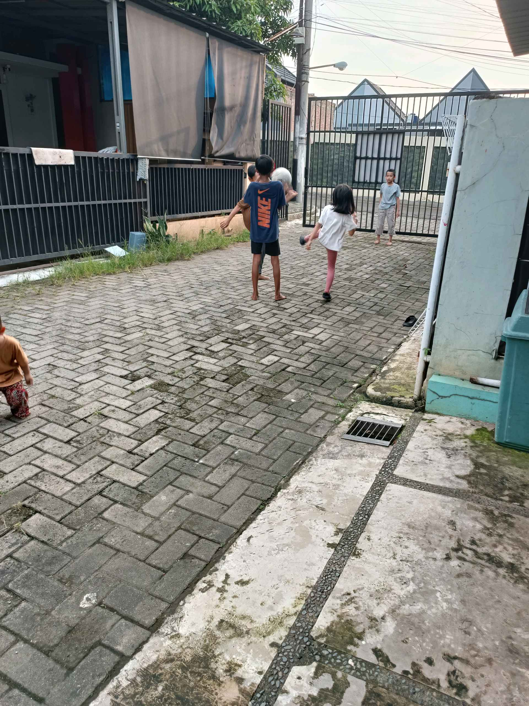

# 26 Mei 2026 - Log Kegiatan Harian
[Kembali](readme.md)

## 📌 Kegiatan
1. Kegiatan Utama:
   - Kegiatan: **Olahraga kekuatan — latihan hang/pull-up** di pull-up bar di teras rumah. Abang bergelantungan dengan kedua tangan, latihan grip strength dan kekuatan otot lengan-bahu.
2. Kegiatan Tambahan:
   - Kegiatan: Bermain di luar — Abang bersama Aasiyah dan teman berlarian di jalan paving depan rumah. Aktivitas fisik kardio + sosial.
   - Alat/bahan: pull-up bar
   - Durasi: -

## 🎯 Capaian Kegiatan
- Latihan kekuatan otot lengan-bahu (pull-up/hang).
- Aktivitas fisik aerobik + interaksi sosial bersama teman sebaya.

## 🚧 Kendala
- -

## 🖼️ Dokumentasi Kegiatan

[Kembali](readme.md)
