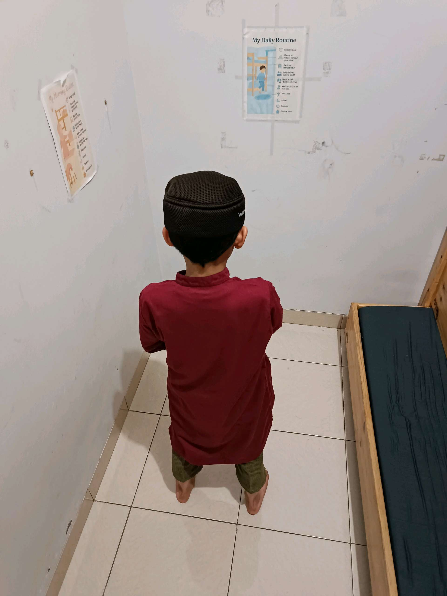

# 27 Mei 2026 - Log Kegiatan Harian
[Kembali](readme.md)

## 📌 Kegiatan
1. Kegiatan Utama:
   - Kegiatan: **Pembiasaan sholat keluarga** — suasana ibadah di rumah; Aasiyah sholat dengan mukena, Abang juga melaksanakan sholat di waktu yang sama. Pembiasaan rutinitas spiritual di lingkungan keluarga.
   - Alat/bahan: mukena/sajadah
   - Durasi: -

## 🎯 Capaian Kegiatan
- Konsistensi rutinitas sholat di rumah.
- Pembiasaan adab ibadah bersama saudara.

## 🚧 Kendala
- -

## 🖼️ Dokumentasi Kegiatan

[Kembali](readme.md)
