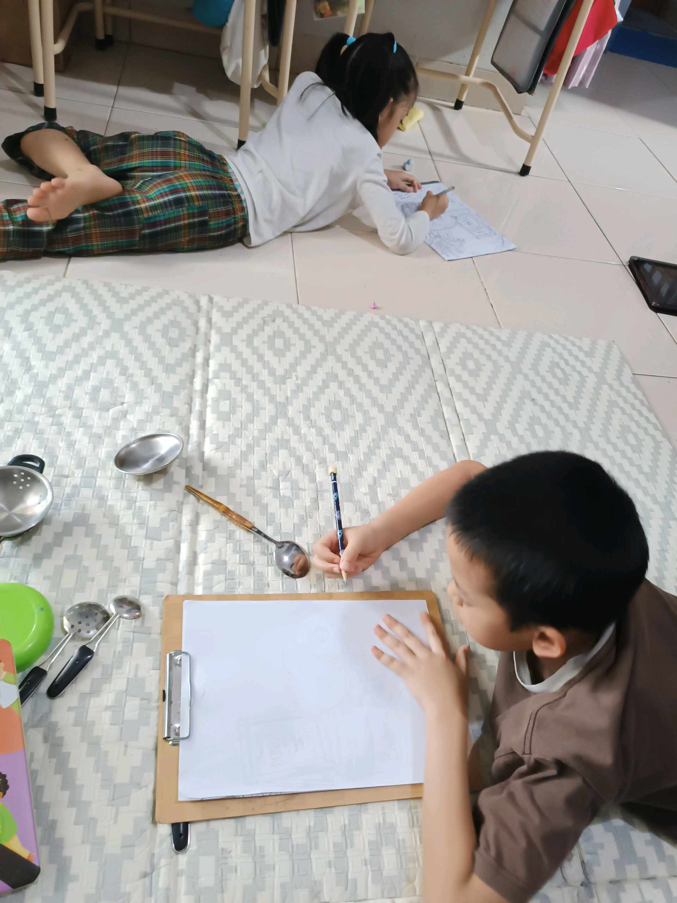

# 28 Mei 2026 - Log Kegiatan Harian
[Kembali](readme.md)

## 📌 Kegiatan
1. Kegiatan Utama:
   - Kegiatan: **SC Seni — sketching still life dengan pensil**. Abang menggambar peralatan dapur (sendok stainless, parutan, sutil, gayung saringan) sebagai model still life di atas tikar. Latihan observasi proporsi dan bentuk benda 3D ke dalam sketsa 2D.
   - Alat/bahan: pensil, clipboard kertas, peralatan dapur sebagai model
   - Durasi: -

## 🎯 Capaian Kegiatan
- Latihan sketching observasional (drawing from life).
- Membaca proporsi dan bentuk benda 3D — fondasi penting menggambar realistis.

## 🚧 Kendala
- -

## 🖼️ Dokumentasi Kegiatan

[Kembali](readme.md)
