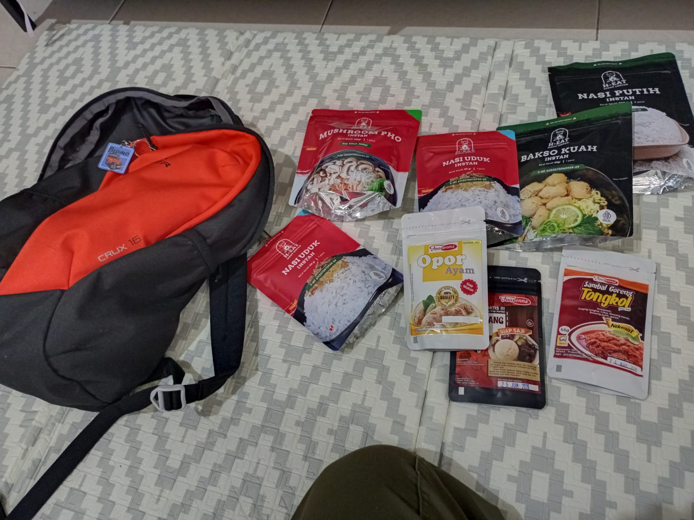

# 19 Juli 2025 - Log Kegiatan Harian
[Kembali](readme.md)

## 📌 Kegiatan
1. Persiapan Keberangkatan Camping Santri:
   - Kegiatan: Packing dan persiapan keberangkatan ke tempat camping santri.
   - Alat/bahan: Tas, pakaian, makanan, dan lain-lain.
   - Durasi: 120 menit (dengan jeda)

2. Membangun dan Merapihkan Tenda:
   - Kegiatan: Mencari lokasi dan meembantu membangun tenda.
   - Alat/bahan: Tenda dan peralatan pendukung
   - Durasi: 45 menit

3. Membangun Tenda:
   - Kegiatan: Mencari lokasi dan meembantu membangun tenda.
   - Alat/bahan: Tenda dan peralatan pendukung
   - Durasi: 45 menit

## 🎯 Capaian Kegiatan
- Musa dapat membantu memasang tenda dengan baik dan menyusun barang-barang didalam tenda.
- Musa menyiapkan peralatan memasak.

## 🚧 Kendala
- 

## 🖼️ Dokumentasi Kegiatan

[Kembali](readme.md)