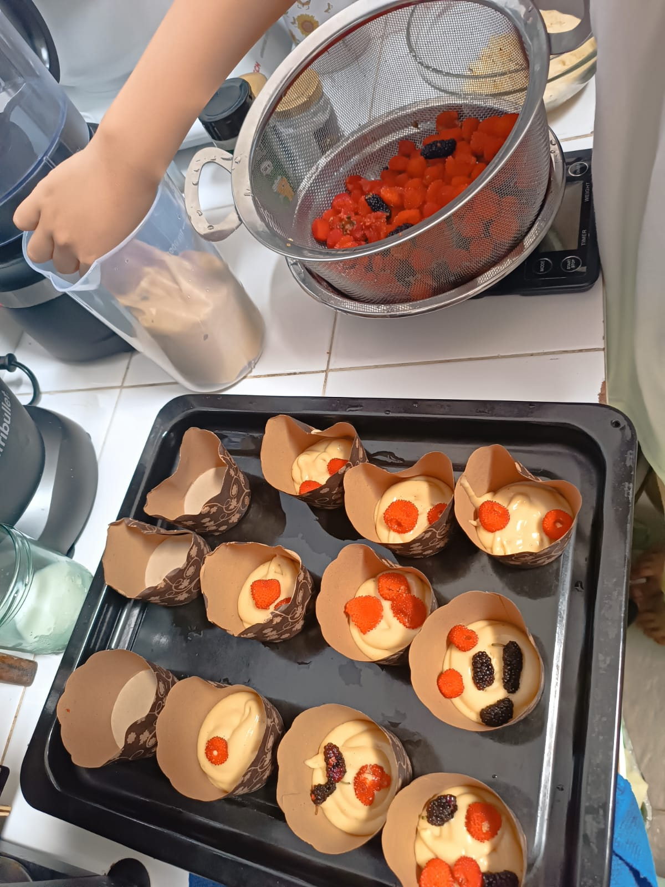

# 22 Juli 2025 - Log Kegiatan Harian
[Kembali](readme.md)

## 📌 Kegiatan
1. Memasak:
   - Kegiatan: Membuat muffin berry hutan (raspberry)
   - Alat/bahan: Raspberry, tepung terigu, gula pasir, telur.
   - Durasi: 120 menit

## 🎯 Capaian Kegiatan
- Memahami konsep penjumlahan uang dan berjual beli

## 🚧 Kendala
- 

## 🖼️ Dokumentasi Kegiatan

[Kembali](readme.md)