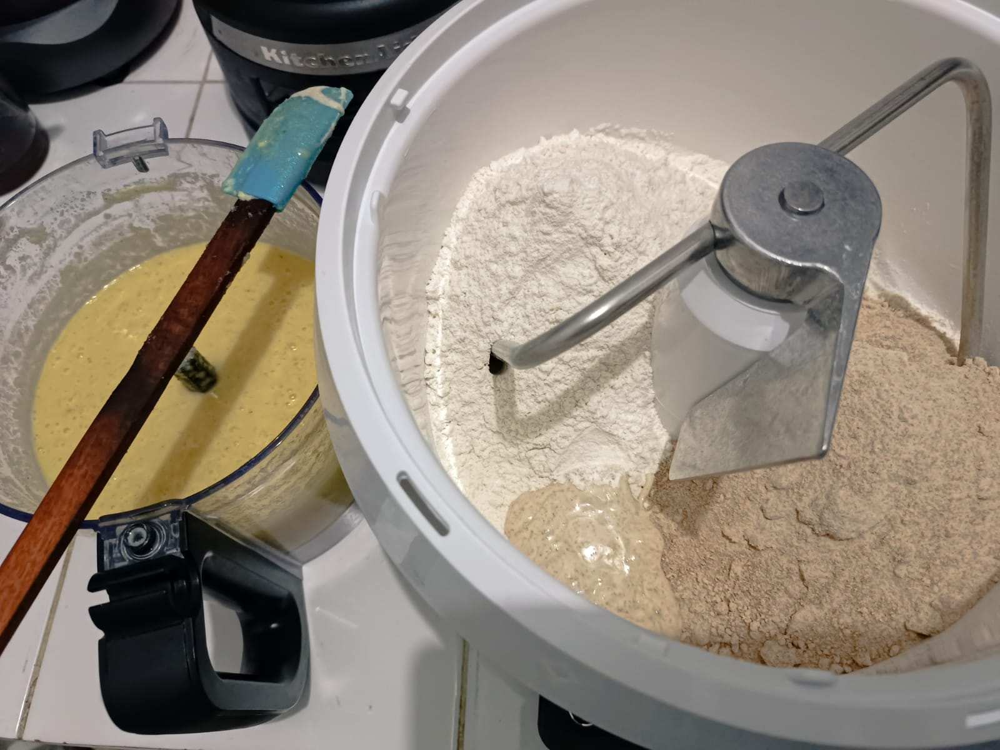

# 27 Juli 2025 - Log Kegiatan Harian
[Kembali](readme.md)

## 📌 Kegiatan
1. Baking:
   - Kegiatan: Bikin adonan roti
   - Alat/bahan: Mixer, tepung terigu, tepung gandum utuh, gula pasir, garam, ragi, air, kentang.
   - Durasi: 60 menit

## 🎯 Capaian Kegiatan
- Menambah literasi dan numerasi dengan menghitung bahan-bahan yang dibutuhkan untuk membuat adonan roti.

## 🚧 Kendala
- 

## 🖼️ Dokumentasi Kegiatan

[Kembali](readme.md)