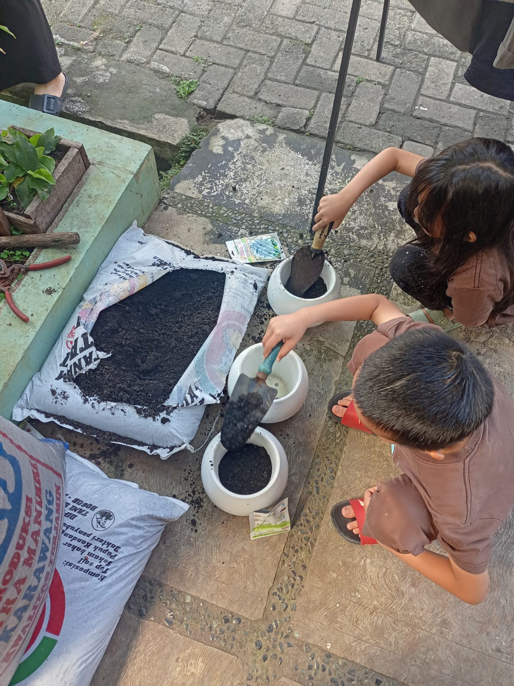
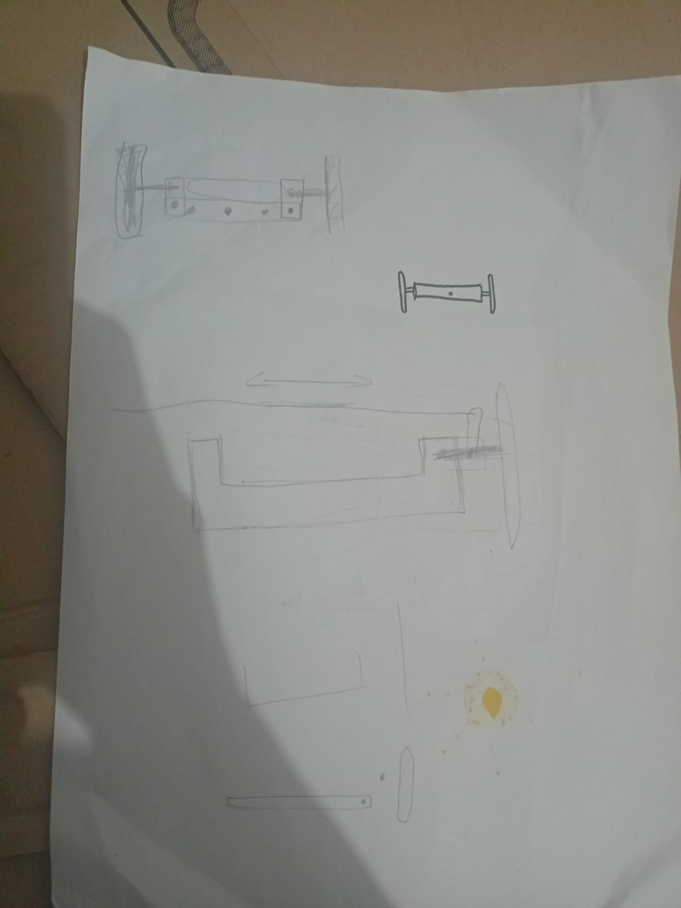

# 03 Agustus 2025 - Log Kegiatan Harian
[Kembali](readme.md)

## 📌 Kegiatan
1. Proyek Mobil Kardus:
   - Kegiatan: Membuat bagian roda depan dan bak belakang
   - Alat/bahan: Kardus, Cutter, Penggaris besi
   - Durasi: 60 menit

2. Berkebun:
   - Kegiatan: Menyemai bibit
   - Alat/bahan: Media tanam, Bibit, Air
   - Durasi: 30 menit

## 🎯 Capaian Kegiatan
- Menyemai bibit tanaman.
- Konsep roda depan dan bak belakang mobil kardus mulai terbentuk.

## 🚧 Kendala
- Anak mengalami kesulitan ketika mendesain mekanisme roda depan mobil kardus.

## 🖼️ Dokumentasi Kegiatan

[Kembali](readme.md)