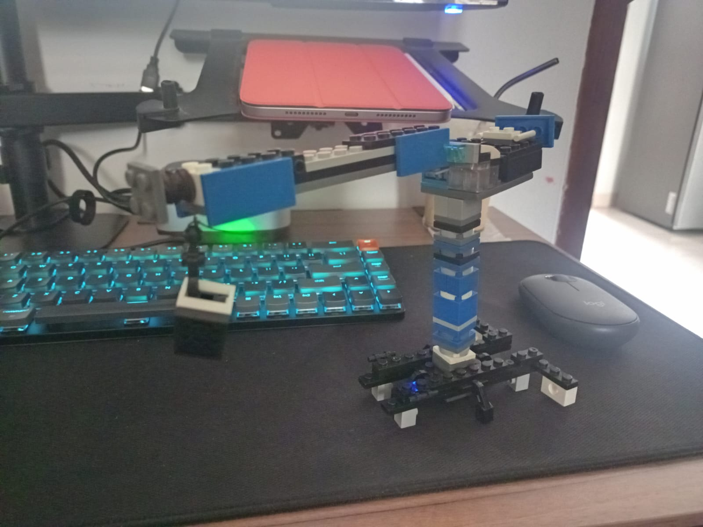
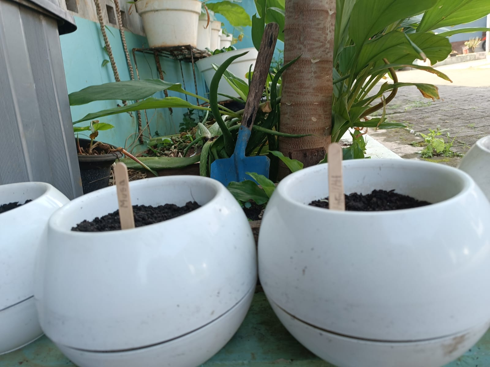
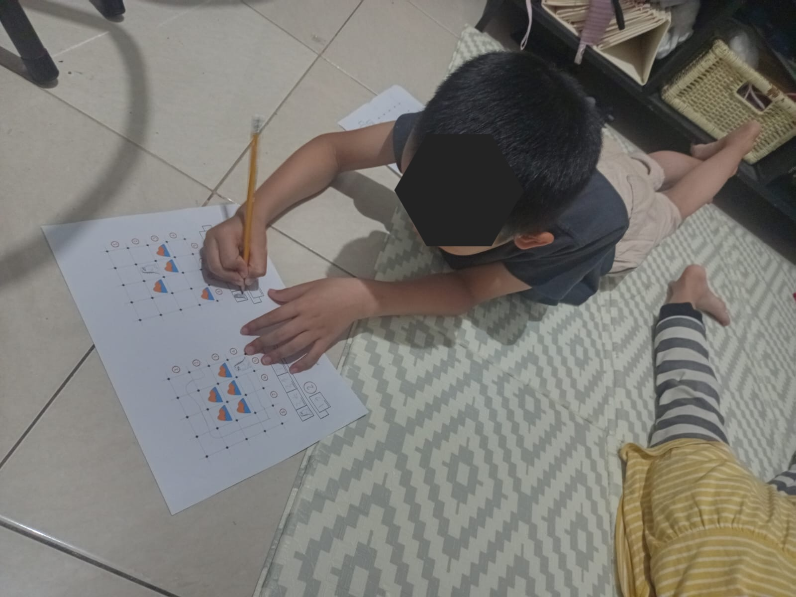

# 04 Agustus 2025 - Log Kegiatan Harian
[Kembali](readme.md)

## 📌 Kegiatan
1. Handcraft:
   - Kegiatan: Membuat lego crane
   - Alat/bahan: Lego, benang lilin
   - Durasi: 60 menit

2. Berkebun:
   - Kegiatan: Mendokumentasikan tanaman & melabel tanaman
   - Alat/bahan: Stick Es Krim
   - Durasi: 30 menit

3. Numerasi:
   - Kegiatan: Mengerjakan worksheet "I am Engineer" Task 18 (Practicing Loops)
   - Alat/bahan: Worksheet "I am Engineer", Pensil
   - Durasi: 30 menit

4. Literasi:
   - Kegiatan: Memabaca AISAR Jilid 2
   - Alat/bahan: Buku AISAR Lish Shighar Jilid 2
   - Durasi: 30 menit

## 🎯 Capaian Kegiatan
- Dokumentasi dan label tanaman.
- Lego crane dengan mekanisme katrol, serta melakukan penyesuaian panjang dan berat antar lengan crane.
- Musa mulai memahami penggunaan loop dalam program dan juga pola instruksi.
- Musa masuk Jilid 2 buku AISAR Lish Shighar.

## 🚧 Kendala
- Musa masih kesulitan dalam memahami konsep loop namun dengan adanya contoh dari baba, Musa mulai memahami sedikit-demi sedikit.
- Sore hari hujan, sehingga kegiatan berkebun dan bermain sore sedikit terganggu.

## 🖼️ Dokumentasi Kegiatan

[Kembali](readme.md)