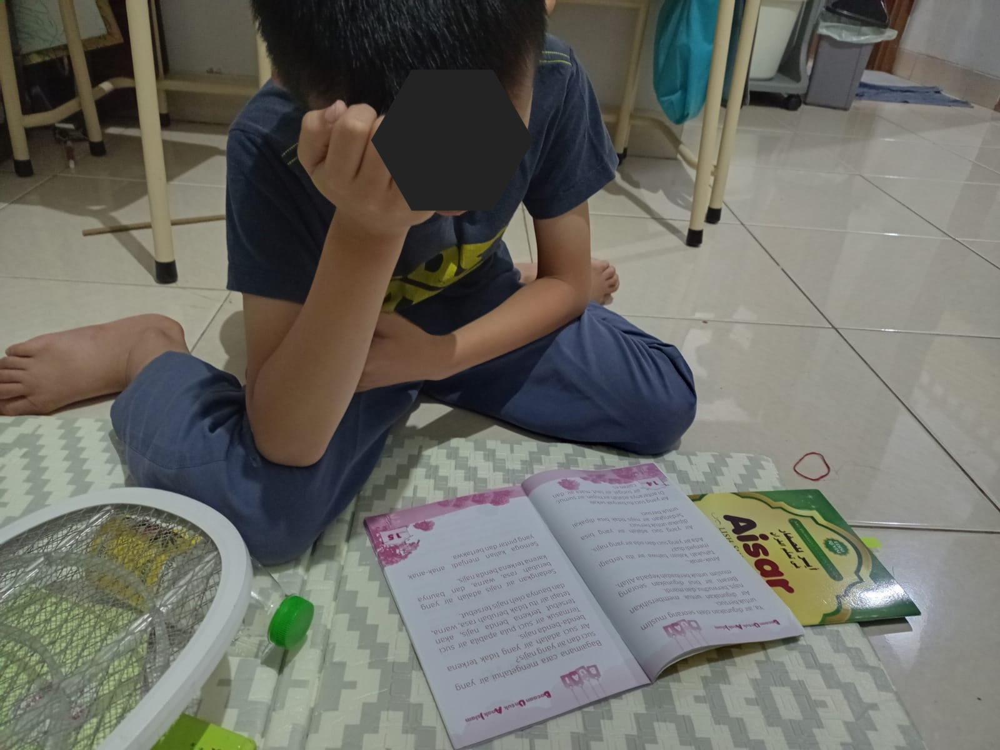
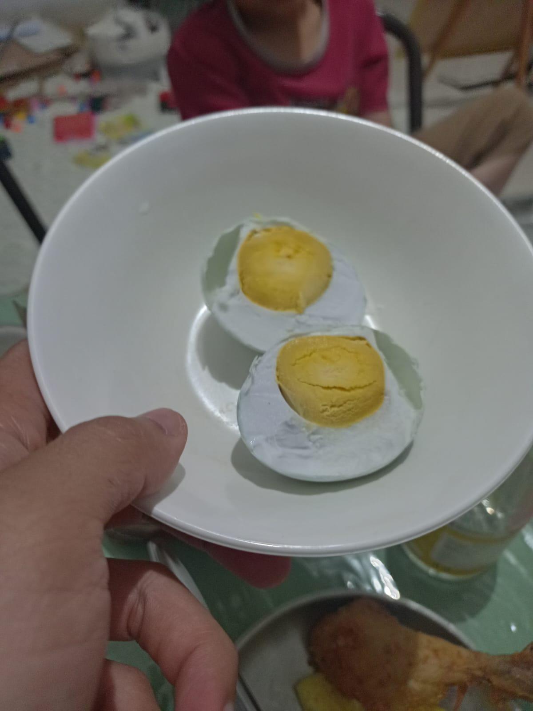

# 04 Agustus 2025 - Log Kegiatan Harian
[Kembali](readme.md)

## 📌 Kegiatan
1. Numerasi:
   - Kegiatan: Melanjutkan mengerjakan worksheet "I am Engineer" Task 18 (Practicing Loops)
   - Alat/bahan: Worksheet "I am Engineer", Pensil
   - Durasi: 30 menit

2. Literasi:
   - Kegiatan: Memabaca AISAR Jilid 2
   - Alat/bahan: Buku AISAR Lish Shighar Jilid 2
   - Durasi: 30 menit

3. Sains:
   - Kegiatan: Mendengarkan baba menjelaskan proses pembuatan telur asin (saat makan malam)
   - Durasi: 30 menit

4. Fiqih Islam:
   - Kegiatan: Membaca buku fiqih islam untuk anak-anak, bab bersuci.
   - Durasi: 30 menit

## 🎯 Capaian Kegiatan
- Musa memahami konsep air suci dan najis, mana air yg bisa dipake wudhu, penyebab air menjadi najis dan ciri-cirinya
- Belajar proses pembuatan telur asin

## 🚧 Kendala
- 

## 🖼️ Dokumentasi Kegiatan

[Kembali](readme.md)